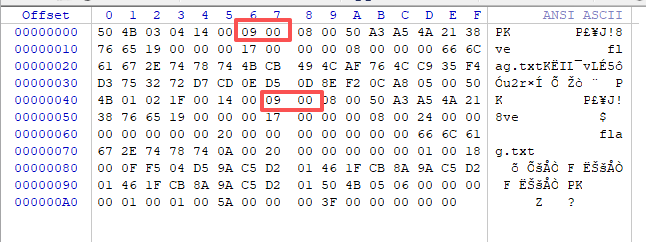

# 压缩包分析

1. `python3 binwalk filename`查看成分
2. `python3 binwalk -e filename` 分离文件
3. `foremost.exe -i filename -o foldname`分离文件（要保证`./foldname`文件夹是空的或者没有这个文件夹）
4. `exiftool xx.jpg` 对图片提取信息（照相机型号等）
5. 010editor看是否真加密

将上图的两个位置的09 00改为00 00尝试绕过伪加密
