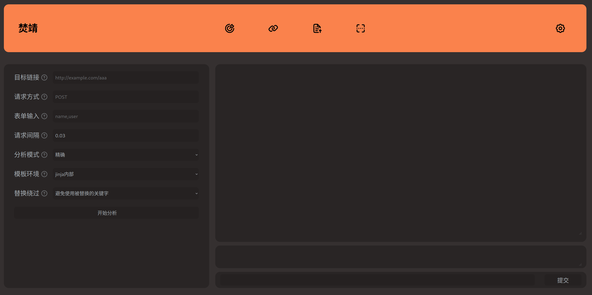

# Fenjing

### 使用pip安装运行

```plain
pip install fenjing
fenjing webui
# fenjing scan --url 'http://xxxx:xxx'
```

### 下载并运行docker镜像

docker run --net host -it marven11/fenjing webui

## 使用

### webui

可以直接输入`python -m fenjing webui`启动webui，指定参数并自动攻击



在左边填入参数并点击开始分析，然后在右边输入命令即可

### scan

在终端可以用scan功能，猜测某个页面的参数并自动攻击：

`python -m fenjing scan --url 'http://xxxx:xxx/yyy'`

### crack

也可以用crack功能，手动指定参数进行攻击：

`python -m fenjing crack --url 'http://xxxx:xxx/yyy' --detect-mode fast --inputs aaa,bbb --method GET`

这里提供了aaa和bbb两个参数进行攻击，并使用`--detect-mode fast`加速攻击速度

### crack-request

还可以将HTTP请求写进一个文本文件里（比如说`req.txt`）然后进行攻击

文本文件内容如下：

```plain
GET /?name=PAYLOAD HTTP/1.1
Host: 127.0.0.1:5000
Connection: close
```

命令如下：

`python -m fenjing crack-request -f req.txt --host '127.0.0.1' --port 5000`

### crack-keywords

如果已经拿到了服务端源码`app.py`的话，可以自动提取代码中的列表作为黑名单生成对应的payload

命令如下：

`python -m fenjing crack-keywords -k app.py -c 'ls /'`

### 其他

此外还支持接受JSON的API，以及根据给定关键字生成payload的用法，详见[examples.md](https://github.com/Marven11/Fenjing/blob/main/examples.md)
