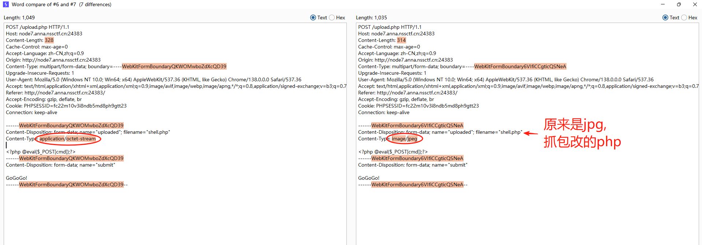
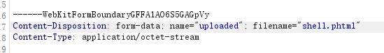

# 文件上传

## .htaccess

1. 上传一个文件面为`.htaccess`的文件

`AddType application/x-httpd-php .png`

作用是让png解析为php

**.htaccess文件是什么**

Hypertext Access

提供针对目录改变配置的方法，在一个特定的文档目录中放置一个包含一个或多个指令的文件， 以作用于此目录及其所有子目录。

针对Apache

可实现网页301重定向、自定义404错误页面、改变文件扩展名、允许/阻止特定的用户或者目录的访问、禁止目录列表、配置默认文档、文件的跳转等功能。

2. 将一句话``保存为`yijuhua.png`
3. 用蚁剑连接

另外，还有一个知识，本题没用到

可以在.htaccess中加入php解析规则，类似把文件名包含1的解析成php

```php
<FilesMatch "1">
SetHandler application/x-httpd-php
</FilesMatch>
```

 1.png 就会以php执行

## MIME绕过

1. 上传一句话php的时候，http header中`Content-Type: application/octet-stream`，校验不通过，包体中修改为`Content-Type: image/png`后校验通过。
2. 也可以上传`jpeg`，然后把 `Content-Disposition` 中的filename改成后缀`php/php /phP/php3/php4/php5/phtml`，结果和上面的相同



## 文件类型绕过

1. 大小写
2. php3、php4、php5
3. phtml



## get 通过data协议上传文件

```php
 <?php
  ini_set("max_execution_time", "180");
  show_source(__FILE__);
  include('flag.php');
  $a= $_GET["a"];
  if(isset($a)&&(file_get_contents($a,'r')) === 'I want flag')
  {
      echo "success\n";
      echo $flag;
  }
?> 
```

`http://node7.anna.nssctf.cn:21210/test2222222222222.php?a=data://text/plain,I want flag`
