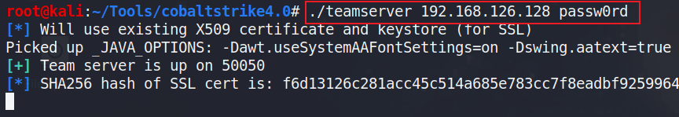
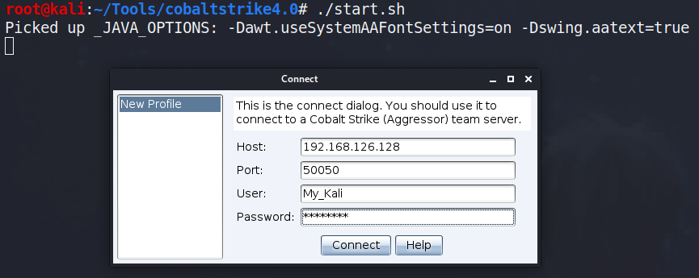
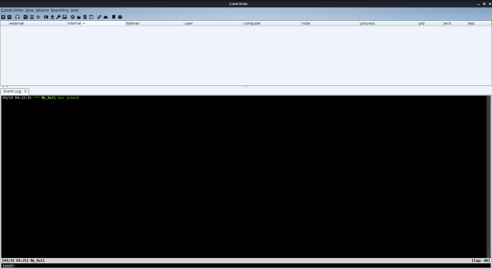
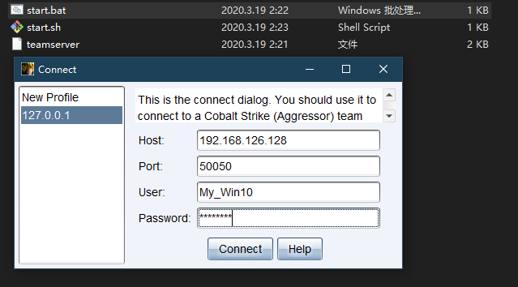
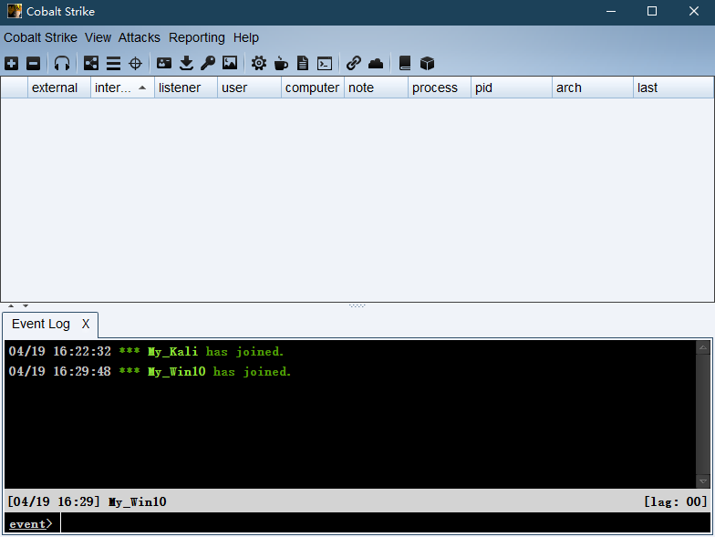
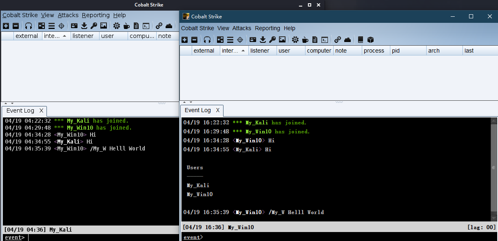
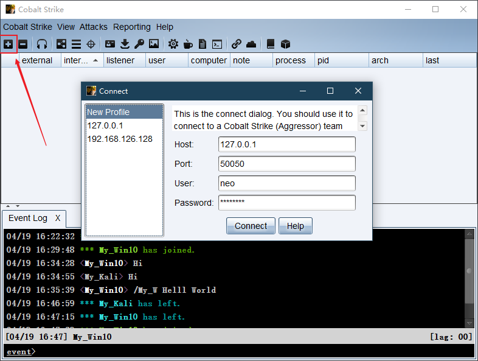

# Cobalt Strike — 0x01 基础操作

## 0x01 基础操作

## 1、介绍

**CS是什么？**

Cobalt Strike是一款渗透测试神器，常被业界人称为CS神器。Cobalt Strike已经不再使用MSF而是作为单独的平台使用，它分为客户端与服务端，服务端是一个，客户端可以有多个，可被团队进行分布式协团操作。

Cobalt Strike集成了端口转发、扫描多模式端口Listener、Windows exe程序生成、Windows dll动态链接库生成、java程序生成、office宏代码生成，包括站点克隆获取浏览器的相关信息等。

早期版本Cobalt Srtike依赖Metasploit框架，而现在Cobalt Strike已经不再使用MSF而是作为单独的平台使用。

这个工具的社区版是大家熟知的Armitage(一个MSF的图形化界面工具)，而Cobalt Strike大家可以理解其为Armitage的商业版。

**CS的发展**

* Armitage \[2010-2012]Armitage是一个红队协作攻击管理工具，它以图形化方式实现了Metasploit框架的自动化攻击。Armitage采用Java构建，拥有跨平台特性。
* Cobalt Strike 1.x \[2012-2014]Cobalt Strike 增强了Metasploit Framework在执行目标攻击和渗透攻击的能力。
* Cobalt Strike 2.x \[2014-?]Cobalt Strike 2是应模拟黑客攻击的市场需求而出现的，Cobalt Strike 2是以malleable C2技术的需求为定位的，这个技术使Cobalt Strike的能力更强了一些。
* Cobalt Strike 3.x \[2015-?]Cobalt Strike 3 的攻击和防御都不用在Metasploit Framework平台（界面）下进行。如今 Cobalt Strike 4.0 也已经发布，改动相比 3.x 还是不小的，笔者在演示的时候使用的 Cobalt Strike 4.0，看的视频教程是 3.x 的教程。

**接下来会用到的工具和环境**

* Cobalt Strike
* Kali
* Metasploit Framework
* PowerSploit
* PowerTools
* Veil Evasion Framework

## 2、客户端与服务端的连接

Cobalt Strike使用C/S架构，Cobalt Strike的客户端连接到团队服务器，团队服务器连接到目标，也就是说Cobalt Strike的客户端不与目标服务器进行交互，那么Cobalt Strike的客户端如何连接到团队服务器就是本文所学习的东西。

**准备工作**

Cobalt Strike的客户端想连接到团队服务器需要知道三个信息：

* 团队服务器的外部IP地址
* 团队服务器的连接密码
* （此项可选）决定Malleable C2工具的哪一个用户配置文件被用于团队服务器

知道这些信息后，就可以使用脚本开启团队服务器了，值得注意的是**Cobalt Strike团队服务器只能运行在Linux环境下**。

**开启团队服务器**

开启团队服务器命令一般如下所示：

```plain
./teamserver your_ip your_passowrd [config_file]
```



服务端开启后，就可以开启客户端进行连接了

**客户端连接到团队服务器**

在Linux下，直接运行start.sh脚本文件，输入团队服务器的IP、密码和自己的用户名进行连接



点击Connect连接后，会有个提示信息，如果承认提示信息中的哈希值就是所要连接团队服务器的哈希值就点击Yes，随后即可打开CS客户端界面



在Windows下的连接方法也基本一致，直接双击**start.bat文件**打开客户端，输入IP、密码、用户名，点击Connect即可





在连接后，团队之间就可以通过客户端进行沟通，信息共享



Cobalt Strike不是用来设计指导在一个团队服务器下进行工作的，而是被设计成在一次行动中使用多个团队服务器。

这样设计的目的主要在于运行安全，如果一个团队服务器停止运行了，也不会导致整个行动的失败，所以接下来看看如何连接到多个团队服务器。

**连接到多个团队服务器**

Cobalt Strike连接到多个团队服务器也很简单，直接点击左上角的加号，输入其他团队服务器的信息后，即可连接



## 3、分布式操作

**最基本的团队服务模型**

这里介绍最基本的团队服务模型，具体由三个服务器构成，具体如下所示：

* 临时服务器（Staging Servers）临时服务器介于持久服务器和后渗透服务器之间，它的作用主要是方便在短时间内对目标系统进行访问。它也是最开始用于传递payload、获取初始权限的服务器，它承担初始的权限提升和下载持久性程序的功能，因此这个服务器有较高暴露风险。
* 持久服务器（Long Haul Servers）持久服务器的作用是保持对目标网络的长期访问，所以持久服务器会以较低的频率与目标保持通信。
* 后渗透服务器（Post-Exploitation Servers）主要进行后渗透及横向移动的相关任务，比如对目标进行交互式访问

**可伸缩红队操作模型**

可伸缩红队操作模型（Scaling Red Operations）分为两个层次，第一层次是针对一个目标网络的目标单元；第二层次是针对多个目标网络的权限管理单元。

目标单元的工作：

* 负责具体目标或行动的对象
* 获得访问权限、后渗透、横向移动
* 维护本地基础设施

访问管理单元的工作：

* 保持所有目标网络的访问权限
* 获取访问权限并接收来自单元的访问
* 根据需要传递对目标单元的访问
* 为持续回调保持全局基础环境

**团队角色**

* 开始渗透人员主要任务是进入目标系统，并扩大立足点
* 后渗透人员主要任务是对目标系统进行数据挖掘、对用户进行监控，收集目标系统的密钥、日志等敏感信息
* 本地通道管理人员主要任务有建立基础设施、保持shell的持久性、管理回调、传递全局访问管理单元之间的会话

## 4、日志与报告

**日志记录**

Cobalt Strike的日志文件在团队服务器下的运行目录中的`logs`文件夹内，其中有些日志文件名例如`beacon_11309.log`，这里的`11309`就是beacon会话的ID。

按键的日志在`keystrokes`文件夹内，截屏的日志在`screenshots`文件夹内，截屏的日志名称一般如`screen_015321_4826.jpg`类似，其中`015321`表示时间（1点53分21秒），`4826`表示ID

**导出报告**

Cobalt Strike生成报告的目的在于培训或帮助蓝队，在`Reporting`菜单栏中就可以生成报告，关于生成的报告有以下特点：

* 输出格式为PDF或者Word格式
* 可以输出自定义报告并且更改图标（Cobalt Strike --> Preferences -->Reporting）
* 可以合并多个团队服务器的报告，并可以对不同报告里的时间进行校正

**报告类型**

* 活动报告（Activity Report）\
  此报告中提供了红队活动的时间表，记录了每个后渗透活动。
* 主机报告（Hosts Report）\
  此报告中汇总了Cobalt Strike收集的主机信息，凭据、服务和会话也会在此报告中。
* 侵害指标报告（Indicators of Compromise）\
  此报告中包括对C2拓展文件的分析、使用的域名及上传文件的MD5哈希。
* 会话报告（Sessions Report）\
  此报告中记录了指标和活动，包括每个会话回连到自己的通信路径、后渗透活动的时间线等。
* 社工报告（Social Engineering Report）\
  此报告中记录了每一轮网络钓鱼的电子邮件、谁点击以及从每个点击用户那里收集的信息。该报告还显示了Cobalt Strike的System profiler发现的应用程序。
* 战术、技巧和程序报告（Tactics,Techniques,and Procedures）\
  此报告将自己的Cobalt Strike行动映射到MITRE的ATT\&CK矩阵中的战术，具体可参考<https://attack.mitre.org/>
