# Cobalt Strike — 0x02 基础设施

## 0x02 基础设施

这一小节学起来感觉有些吃力，里面很多概念理解的不是很清楚，如果有大佬看到描述错误的地方欢迎留言指正，避免误导他人。

再次声明，这只是我的个人学习笔记，就不要当成教程去看了，建议想学习CS的小伙伴可以看看A-TEAM的中文手册或者网上的一些视频教程。

## 1、监听器管理

* 什么是监听器顾名思义，监听器就是等待被入侵系统连接自己的一个服务。
* 监听器的作用主要是为了接受payload回传的各类数据，类似于MSF中handler的作用。比如payload在目标机器执行以后，就会回连到监听器然后下载执行真正的shellcode代码。

一旦监听器建立起来，团队成员只需要知道这个监听器的名称即可，不用关心监听器背后的基础环境，接下来将深入了解如何准确配置监听器。

一个监听器由用户定义的名称、payload 类型和几个特定于 payload 的选项组成。

监听器的名字一般由以下结构组成：

```plain
Operating System/Payload/Stager
```

例如：

```plain
windows/beacon_http/reverse_http
```

**什么是传输器**

攻击载荷`payload`就是攻击执行的内容。攻击载荷通常被分为两部分：传输器`stager` 和传输体`stage`。

传输器`stager`是一个小程序，用于连接、下载传输体`stage`，并插入到内存中。

我个人理解为：攻击载荷里真正用于攻击的代码是在传输体里。

所以为什么要有传输体？直接把攻击载荷插入到内存中不更方便快捷、更香么，搞得又是传输器又是传输体的。

需要传输体是因为在很多攻击中对于能加载进内存，并在成功漏洞利用后执行的数据大小存在严格限制。这就导致在攻击成功时，很难嵌入额外的攻击载荷，正是因为这些限制，才使得传输器变得有必要了。

**创建监听器**

在CS客户端中打开 Cobalt Strike —》Listeners，之后点击Add，此时弹出New Listener窗口，在填写监听器的相关信息之前，需要先来了解监听器有哪些类型。

Cobalt Strike有两种类型的监听器：

* BeaconBeacon直译过来就是灯塔、信标、照亮指引的意思，Beacon是较为隐蔽的后渗透代理，笔者个人理解Beacon类型的监听器应该是平时比较常用的。Beacon监听器的名称例如：

```plain
windows/beacon_http/reverse_http
```

* ForeignForeign直译就是外部的，这里可以理解成`对外监听器`，这种类型的监听器主要作用是给其他的Payload提供别名，比如Metasploit 框架里的Payload，笔者个人理解Foreign监听器在一定程度上提高了CS的兼容性。对外监听器的名称例如：

```plain
windows/foreign/reverse_https
```

## 2、HTTP 和 HTTPS Beacon

**Beacon是什么**

* Beacon是CS的Payload
* Beacon有两种通信模式。一种是异步通信模式，这种模式通信效率缓慢，Beacon回连团队服务器、下载任务、然后休眠；另一种是交互式通信模式，这种模式的通信是实时发生的。
* 通过HTTP、HTTPS和DNS出口网络
* 使用SMB协议的时候是点对点通信
* Beacon有很多的后渗透攻击模块和远程管理工具

**Beacon的类型**

* HTTP 和 HTTPS BeaconHTTP和HTTPS Beacon也可以叫做Web Beacon。默认设置情况下，HTTP 和 HTTPS Beacon 通过 HTTP GET 请求来下载任务。这些 Beacon 通过 HTTP POST 请求传回数据。

```plain
windows/beacon_http/reverse_http
windows/beacon_https/reverse_https
```

* DNS Beacon

```plain
windows/beacon_dns/reverse_dns_txt
windows/beacon_dns/reverse_http
```

* SMB BeaconSMB Beacon也可以叫做pipe beacon

```plain
windows/beacon_smb/bind_pipe
```

**创建一个HTTP Beacon**

点击 Cobalt Strike  --> Listeners 打开监听器管理窗口，点击Add，输入监听器的名称、监听主机地址，因为这里是要创建一个HTTP Beacon，所以其他的默认就行，最后点击Save

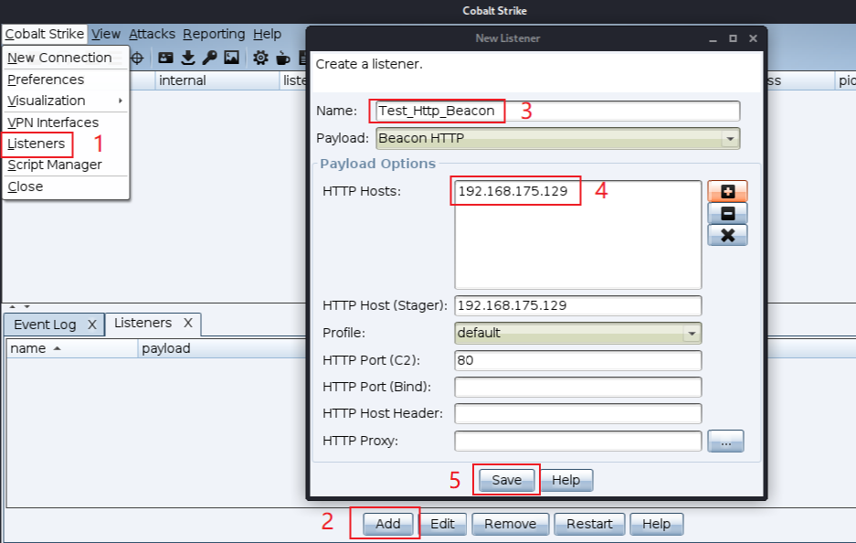

此时可以测试一下刚才设置的监听器，点击Attack --> Web Drive-by --> Scripted Web Delivery(s) ，在弹出的窗口中选择刚才新添的Listener，因为我的靶机是64位的，所以我把Use x64 payload也给勾选上了，最后点击Launch

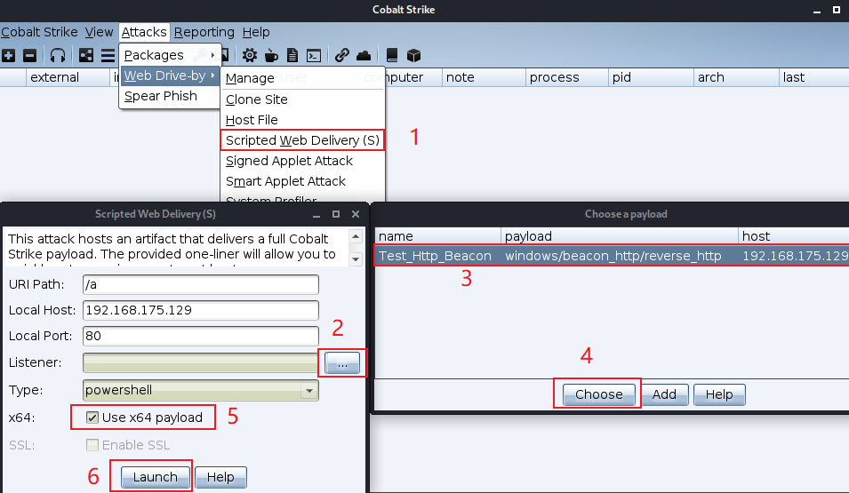

复制弹窗的命令，放到靶机中运行

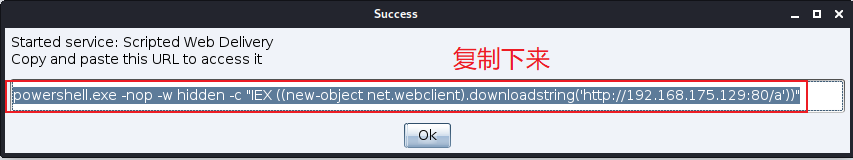

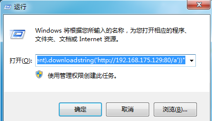

此时，回到CS，就可以看到已经靶机上线了

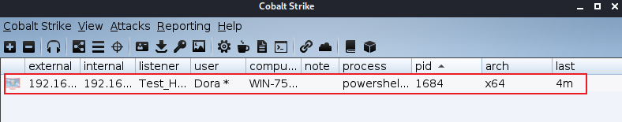

**HTTPS Beacon**

HTTPS Beaocn和HTTP Beacon一样，使用了相同的Malleable C2配置文件，使用GET和POST的方式传输数据，不同点在于HTTPS使用了SSL，因此HTTPS Beacon就需要使用一个有效的SSL证书，具体如何配置可以参考：<https://www.cobaltstrike.com/help-malleable-c2#validssl>

## 3、DNS Beacon

DNS Beacon，顾名思义就是使用DNS请求将Beacon返回。这些 DNS 请求用于解析由你的 CS 团队服务器作为权威 DNS 服务器的域名。DNS 响应告诉 Beacon 休眠或是连接到团队服务器来下载任务。DNS 响应也告诉 Beacon 如何从你的团队服务器下载任务。

在CS 4.0及之后的版本中，DNS Beacon是一个仅DNS的Payload，在这个Payload中没有HTTP通信模式，这是与之前不同的地方。

> 以上内容摘自 A-TEAM 团队的 CS 4.0 用户手册

DNS Beacon的工作流程具体如下：

首先，CS服务器向目标发起攻击，将DNS Beacon传输器嵌入到目标主机内存中，然后在目标主机上的DNS Beacon传输器回连下载CS服务器上的DNS Beacon传输体，当DNS Beacon在内存中启动后就开始回连CS服务器，然后执行来自CS服务器的各种任务请求。

原本DNS Beacon可以使用两种方式进行传输，一种是使用HTTP来下载Payload，一种是使用DNS TXT记录来下载Payload，不过现在4.0版本中，已经没有了HTTP方式，CS4.0以及未来版本都只有DNS TXT记录这一种选择了，所以接下来重点学习使用DNS TXT记录的方式。

根据作者的介绍，DNS Beacon拥有更高的隐蔽性，但是速度相对于HTTP Beacon什么的会更慢。

**域名配置**

既然是配置域名，所以就需要先有个域名，这里就用我的博客域名作为示例：添加一条A记录指向CS服务器的公网IP，再添加几条ns记录指向A记录域名即可。

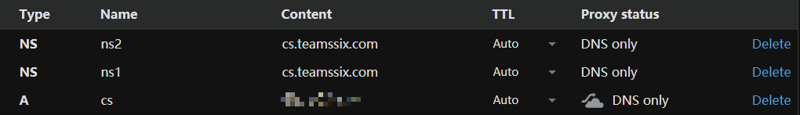

添加一个监听器，DNS Hosts填写NS记录和A记录对应的名称，DNS Host填写A记录对应的名称

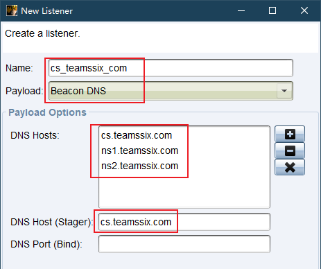

根据上一章的方法创建一个攻击脚本，放到目标主机中运行后，在CS客户端可以看到一个小黑框

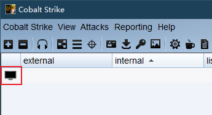

然后经过一段时间的等待，就可以发现已经上线了

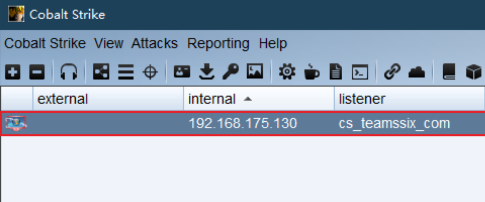

## 4、SMB Beacon

SMB Beacon 使用命名管道通过一个父 Beacon 进行通信。这种对等通信对同一台主机上的 Beacon 和跨网络的 Beacon 都有效。Windows 将命名管道通信封装在 SMB 协议中。因此得名 SMB Beacon。

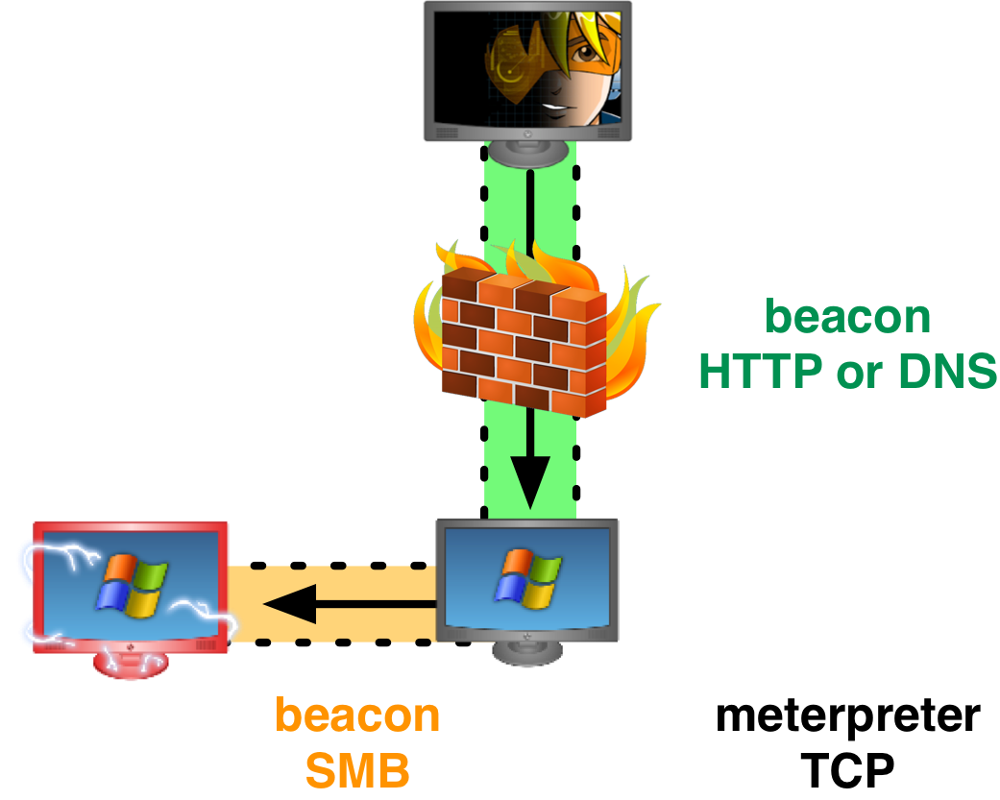

因为链接的Beacons使用Windows命名管道进行通信，此流量封装在SMB协议中，所以SMB Beacon相对隐蔽，绕防火墙时可能发挥奇效(系统防火墙默认是允许445的端口与外界通信的，其他端口可能会弹窗提醒，会导致远程命令行反弹shell失败)。

SMB Beacon监听器对“提升权限”和“横向渗透”中很有用。

**SMB Beacon 配置**

首先需要一个上线的主机，这里我使用的HTTP Beacon，具体如何上线，可以参考之前第5节《如何建立Payload处理器》学习笔记中的内容，这里不过多赘述。

主机上线后，新建一个SMB Beacon，输入监听器名称，选择Beacon SMB，管道名称可以直接默认，也可以自定义。

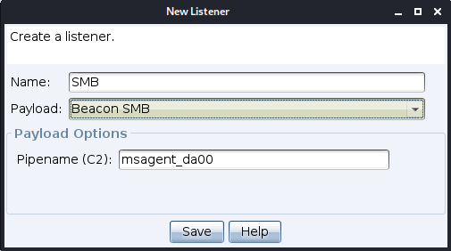

接下来在Beacon中直接输入`spawn SMB`，这里的`SMB`指代的是创建的SMB Beacon的监听器名称，也可以直接右击session，在Spawn选项中选择刚添加的SMB Beacon。

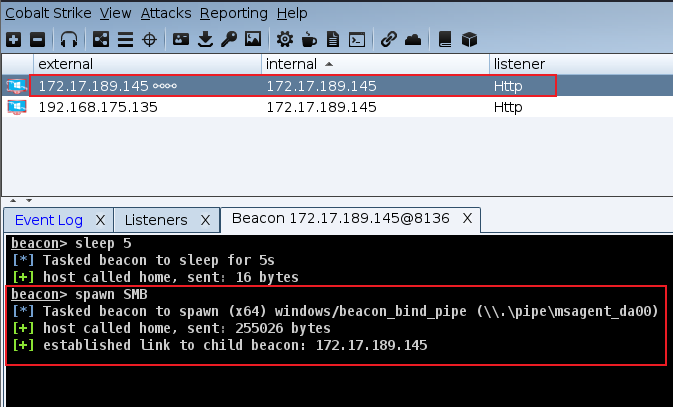

等待一会儿，就可以看到派生的SMB Beacon，在external中可以看到IP后有个`∞∞`字符。

接下来我这里将SMB Beacon插入到进程中，以vmtoolsed进程为例。

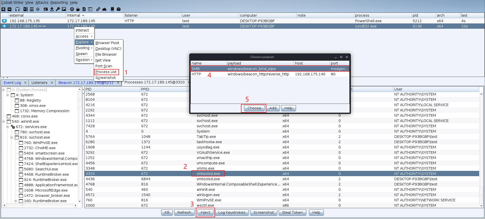

在vmtoolsed中插入SMB Beacon后，便能看到process为vmtoolsed.exe的派生SMB Beacon。

当上线主机较多的时候，只靠列表的方式去展现，就显得不太直观了，通过CS客户端中的透视图便能很好的展现。

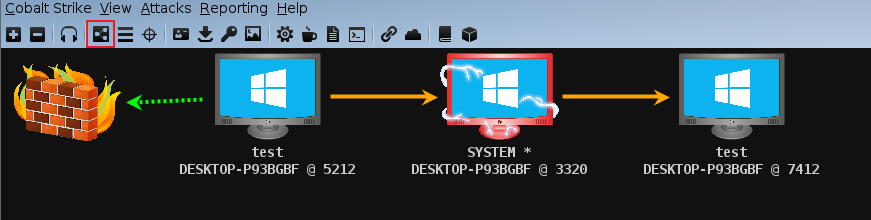

在CS中，如果获取到目标的管理员权限，在用户名后会有`*`号标注，通过这个区别，可以判断出当前上线的test用户为普通权限用户，因此这里给他提升一下权限。

**提权**

> 由于下面与上面内容的笔记不是在同一天写的，因此截图中上线的主机会有所差异，这里主要是记录使用的方法。

由于CS自带的提权方式较少，因此这里就先加载一些网上的提权脚本，脚本下载地址为：<https://github.com/rsmudge/ElevateKit>

下载之后，打开`Cobalt Strike --> Script Manager` ，之后点击`Load`，选择自己刚才下载的文件中的`elevate.cna`文件。

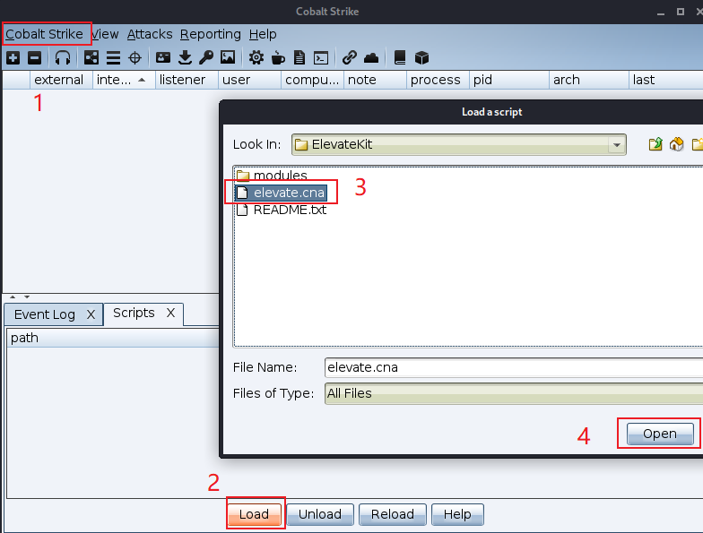

接着选择要提权的主机，右击选择`Access --> Elevate`，Listener中选择刚才新建的SMB Beacon，这里的Exploit选择了ms14-058，如果使用ms14-058不能提权，就换一个Exploit进行尝试。

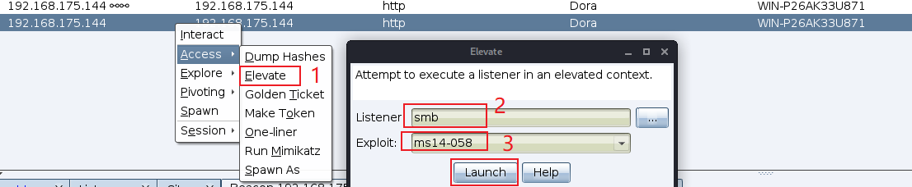

顺利的情况下，就可以看到提权后的管理员权限会话了，在管理员权限的会话中，不光用户名后有个\*号，其Logo也是和其他会话不同的。

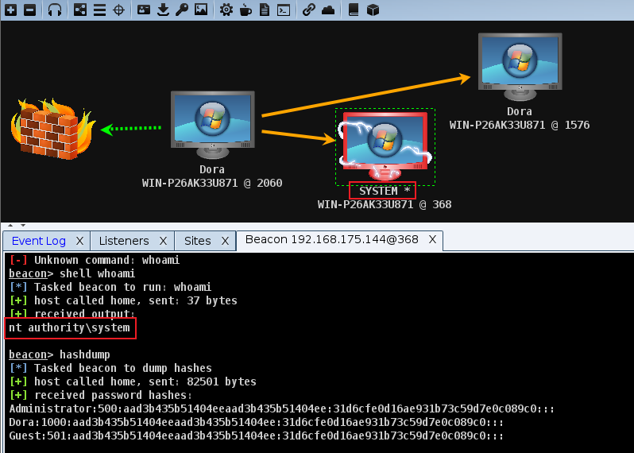

**连接与断开**

此时如果想断开某个会话的连接，可以使用unlink命令，比如如果想断开192.168.175.144，就可以在Beacon中输入`unlink 192.168.175.144`

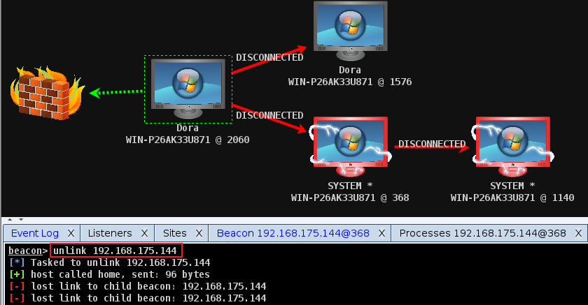

如果想再次连上，就直接输入`link 192.168.175.144`，想从当前主机连到其他主机也可以使用此命令。

## 5、重定向器

重定向器`Redirectors`是一个位于CS团队服务器和目标网络之间的服务器，这个重定向器通俗的来说就是一个代理工具，或者说端口转发工具，担任CS服务器与目标服务器之间的跳板机角色，整体流量就像下面这样。

```plain
目标靶机 <-------->多个并列的重定向器<------>CS服务器
```

重定向器在平时的攻击或者防御的过程中起到很重要的作用，主要有以下两点：

* 保护自己的CS服务器，避免目标发现自己的真实IP
* 提高整体可靠性，因为可以设置多个重定向器，因此如果有个别重定向器停止工作了，整体上系统依旧是可以正常工作的

**创建一个重定向器**

这里就使用自己的内网环境作为测试了，首先理清自己的IP

CS服务器IP：192.168.175.129

目标靶机IP：192.168.175.130

重定向器IP：192.168.175.132、192.168.175.133

首先，需要先配置重定向器的端口转发，比如这里使用HTTP Beacon，就需要将重定向器的80端口流量全部转发到CS服务器上，使用socat的命令如下：

```plain
socat TCP4-LISTEN:80,fork TCP4:192.168.175.129:80
```

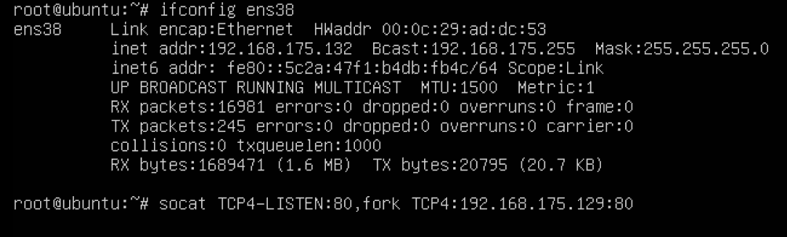

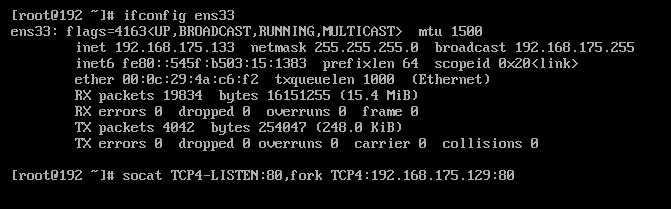

如果提示没有socat命令，安装一下即可。重定向器设置好之后，就新建一个HTTP Beacon，并把重定向器添加到HTTP Hosts主机列表中

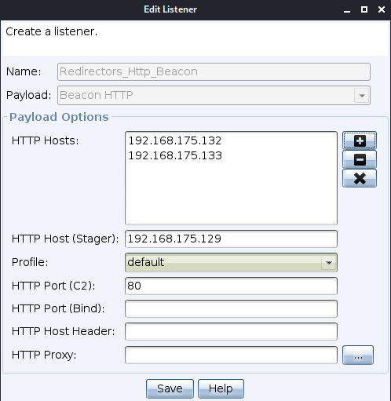

此时可以测试一下重定向器是否正常工作，在CS中打开 View --> Web Log，之后浏览器访问CS服务器地址，也就是这里的192.168.175.129

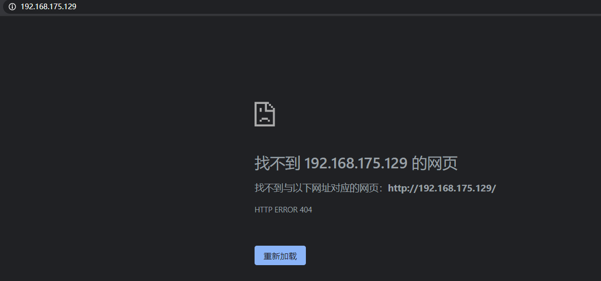

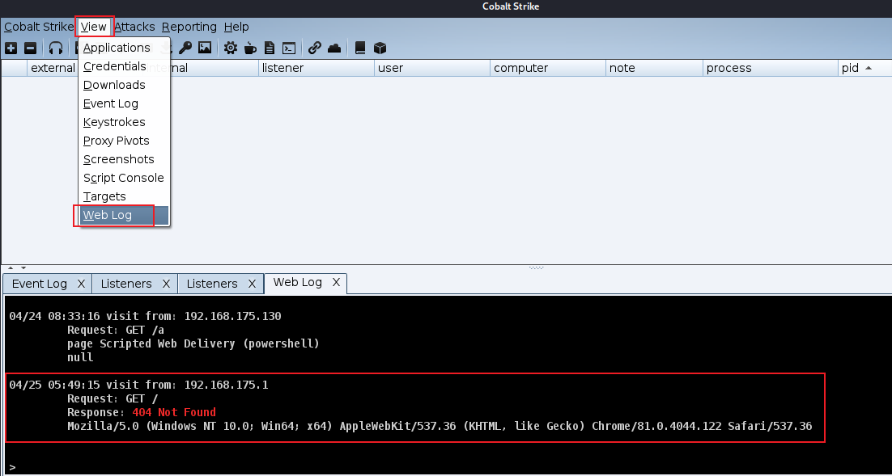

可以看到CS是能够正常接收到流量的，说明重定向器已经配置OK了，此时按照上面创建一个HTTP Beacon的操作，创建一个HTTP Beacon，并在靶机中运行

当靶机上线的时候，观察靶机中的流量，可以看到与靶机连接的也是重定向器的IP

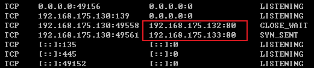

在CS中也可以看到上线主机的外部IP也是重定向器的IP，此时如果关闭一个重定向器，系统依旧可以正常工作。

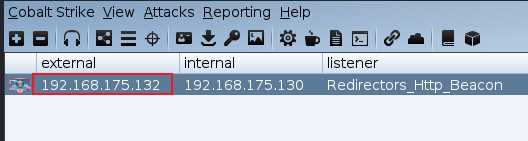

由于笔者在学习CS过程中，所看的教程使用的是3.x版本的CS，而我使用的是4.0版本的CS。因此域名配置实操部分是自己参考网上大量文章后自己多次尝试后的结果，所以难免出现错误之处，要是表哥发现文中错误的地方，欢迎留言指正。

## 6、攻击载荷安全特性

1、在Beacon传输Payload到目标上执行任务时都会先验证团队服务器，以确保Beacon只接受并只运行来自其团队服务器的任务，并且结果也只能发送到其团队服务器。

2、在刚开始设置Beacon Payload时，CS会生成一个团队服务器专有的公私钥对，这个公钥嵌入在Beacon的Payload Stage中。Beacon使用团队服务器的公钥来加密传输的元数据，这个元数据中一般包含传输的进程ID、目标系统IP地址、目标主机名称等信息，这也意味着只有团队服务器才能解密这个元数据。

3、当Beacon从团队服务器下载任务或团队服务器接收Beacon输出时，团队服务器将会使用Beacon生成的会话秘钥来加密任务并解密输出。

4、值得注意的是，Payload Stagers 因为其体积很小，所以没有这些的安全特性。
