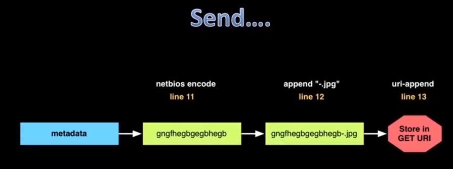
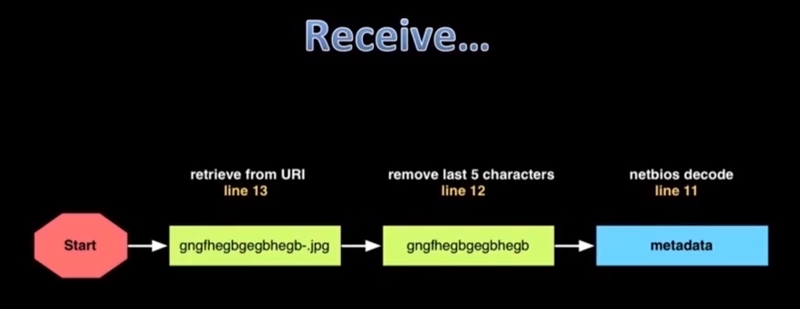
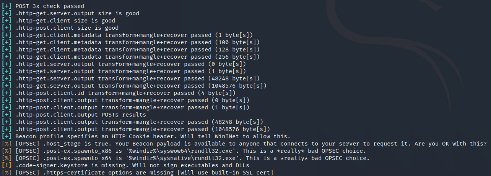
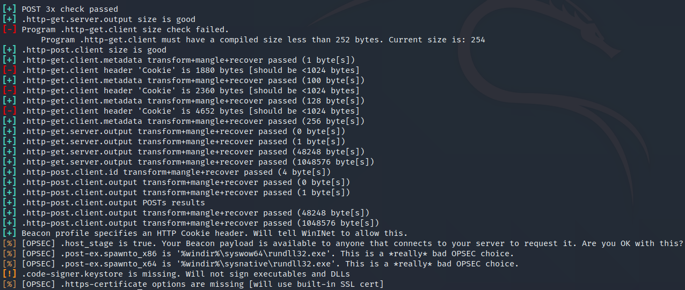
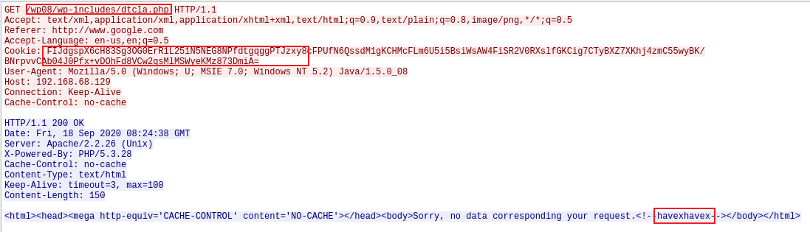

# Cobalt Strike — 0x08 Malleable C2

## 0x08 Malleable C2

## 1、Malleable 命令和控制

Malleable 是一种针对特定领域的语言，主要用来控制 Cobalt Strike Beacon

在开启 teamserver 时，在其命令后指定配置文件即可调用，比如：

```plain
./teamserver [ip address] [password] [profile]
```

## 2、设置和使用

**定义事务指标**

```plain
http-get {
    # 指标
}
http-post {
    # 指标
}
```

**控制客户端和服务端指标**

```plain
http-get {
    client {
        # 指标
    }
    server {
        # 指标
    }
}
```

**set  操作**

set 语句是给一个选项赋值的方法，以分号结束。

```plain
set useragent "Mozilla/5.0 (compatible; MSIE 8.0; Windows NT 5.1)";
```

malleable 给了我们很多选项，比如：

```plain
jitter		# 控制 beacon 默认回连的抖动因子
maxdns		# 控制最大 DNS 请求，限制最大数量可以使 DNS Beacon 发送数据看起来正常些
sleeptime	# 控制 beacon 的全部睡眠时间,即延迟时间。
spawnto
uri
useragent	# 控制每次发送请求的 useragent
```

`sleeptime` 和 `jitter` 两个选项是很重要的

*流量隐藏*

Cobalt Strike为了隐藏流量，不能做到像MSF一样即时响应。\


**添加任意 headers**

```plain
header "Accept" "text/html,application/xhtml";
header "Referer" "https://www.google.com";
header "Progma" "no-cache";
header "Cache-Control" "no-cache";
```

**其他指标**

```plain
header "header" "value";
parameter "key" "value";
```

**转换/存储数据**

```plain
metadata {
    netbios;
    append "-.jpg";
    uri-append;
}
```





## 3、配置语言

```plain
append "string"
base64
netbios
netbiosu
prepend "string"
```

## 4、测试配置文件

在GitHub 上有一些配置文件的示例，项目地址：<https://github.com/rsmudge/Malleable-C2-Profiles>

这一节将使用该项目中的 `Malleable-C2-Profiles/APT/havex.profile` 配置文件作为示例。

**测试配置文件是否有效**

可以使用 c2lint 工具对配置文件进行测试，以判断配置文件编写的是否有效。

来到 cobalt strike 目录下，可以看到有一个 c2lint 文件，该文件需要在 Linux 下运行。

```plain
./c2lint [profile]
```

在运行的结果中，绿色正常（这里更像青色），黄色告警，红色错误，比如运行 `Malleable-C2-Profiles` 项目里的 `havex.profile` 文件。

```plain
./c2lint ./Malleable-C2-Profiles/APT/havex.profile
```



当配置文件存在错误的时候，就会以红色显示出来



**运行 teamserver**

```plain
./teamserver [teamserver_ip] [teamserver_password] [profile]
```

```plain
> ./teamserver 192.168.12.2 password ./Malleable-C2-Profiles/APT/havex.profile
[*] Will use existing X509 certificate and keystore (for SSL)
Picked up _JAVA_OPTIONS: -Dawt.useSystemAAFontSettings=on -Dswing.aatext=true
[+] I see you're into threat replication. ./Malleable-C2-Profiles/APT/havex.profile loaded.
[+] Team server is up on 50050
```

这里调用的 havex.profile 配置文件，该配置文件里对 cookie 进行了 base64 编码。

开启 cobalt strike 后，使主机上线，通过 wireshark 抓包可以发现数据包确实符合这些特征。



关于 Malleable C2 文件的使用，这里只是大概记录了一些，想了解更多关于 Malleable C2 文件的内容或者注意事项等，可以参考 A-TEAM 团队的 CS 4.0 用户手册。
