# Cobalt Strike — 0x09 免杀

## 0x09 免杀

Cobalt Strike 不是什么工作情况都能胜任的工具，因此就需要我们根据不同的情况去做一些辅助工作。

## 1、DKIM、SPF 和 DMARC

SPF、DKIM、DMARC 都是邮件用于帮助识别垃圾信息的附加组件，那么作为一个攻击者，在发送钓鱼邮件的时候，就需要使自己的邮件能够满足这些组件的标准，或者发送到未配置这些组件的域。

在理解这些防御标准前，需要先理解如何在因特网上通过 SMTP 发送邮件。

**SMTP**

发送一封邮件的过程大概是下面这个样子，这里以QQ邮箱为例。

```plain
> telnet smtp.qq.com 25
HELO teamssix
auth login
base64编码后的邮箱名
base64编码后的授权码
MAIL FROM: <evil_teamssix@qq.com>
RCPT TO: <target_teamssix@qq.com>
DATA
邮件内容
.
QUIT
```

**防御策略**

### DKIM

DKIM `DomainKeys Identified Mail` 域名密钥识别邮件，DKIM 是一种防范电子邮件欺诈的验证技术，通过消息加密认证的方式对邮件发送域名进行验证。

邮件接收方接收邮件时，会通过 DNS 查询获得公钥，验证邮件 DKIM 签名的有效性，从而判断邮件是否被篡改。

### SPF

SPF `Sender Policy Framework` 发送人策略框架，SPF 主要用来防止随意伪造发件人。其做法就是设置一个 SPF 记录，SPF 记录实际上就是 DNS 的 TXT 记录。

如果邮件服务器收到一封来自 IP 不在 SPF 记录里的邮件则会退信或者标记为垃圾邮件。

我们可以使用以下命令查看目标的 SPF 记录。

```plain
dig +short TXT target.com
```

```plain
> dig +short TXT qq.com
"v=spf1 include:spf.mail.qq.com -all"
```

上面的 `include:spf.mail.qq.com` 表示引入`spf.mail.qq.com`域名下的 SPF 记录。

```plain
> dig +short TXT spf-a.mail.qq.com
"v=spf1 ip4:203.205.251.0/24 ip4:103.7.29.0/24 ip4:59.36.129.0/24 ip4:113.108.23.0/24 ip4:113.108.11.0/24 ip4:119.147.193.0/24 ip4:119.147.194.0/24 ip4:59.78.209.0/24 ip4:113.96.223.0/24 ip4:183.3.226.0/24 ip4:183.3.255.0/24 ip4:59.36.132.0/24 -all"
```

上面的 `ip4:203.205.251.0/24 ip4:103.7.29.0/24` 表示只允许这个范围内的 IP 发送邮件。

### DMARC

DMARC `Domain-based Message Authentication, Reporting & Conformance` 基于域的消息认证，报告和一致性。

它用来检查一封电子邮件是否来自所声称的发送者。DMARC 建立在 SPF 和 DKIM 协议上, 并且添加了域名对齐检查和报告发送功能。这样可以改善域名免受钓鱼攻击的保护。

可以使用下面的命令查看目标的的 DMARC 记录。

```plain
dig +short TXT _dmarc.target.com
```

```plain
> dig +short TXT _dmarc.qq.com
"v=DMARC1; p=none; rua=mailto:mailauth-reports@qq.com"
```

也有一些在线网站支持检测 SPF、DKIM、DMARC 的记录，比如 <https://dmarcly.com/tools/>

关于这些记录查询返回结果的解释可参考文章末的参考链接。

**发送钓鱼邮件的一些注意事项**

1、检测目标是否有 SPF 记录，如果有则可能会被拦截

2、检测目标 DMARC 记录的 p 选项是否为 reject ，如果有则可能会被拒绝

3、模板中嵌入的 URL 地址，不要使用 IP 地址，要保证使用完整的 URL地址

4、邮件的附件中不能附上一些可执行文件，比如 exe 格式的文件，因为一些邮件过滤器可能会将这些可执行文件删除

## 2、杀毒软件

这一节将来看看杀毒软件相关的概念，毕竟知己知彼才能百战不殆，最后会介绍一下常见的免杀方法。

常规杀毒软件的目的就是发现已知病毒并中止删除它，而作为攻击者则需要对病毒文件进行免杀处理，从而使杀毒软件认为我们的文件是合法文件。

**杀软受到的限制**

1、杀毒软件不能把可疑文件删除或者结束运行，否则用户的正常操作可能就会受到影响，同时也会对杀毒软件公司的声誉、口碑产生影响。

2、杀毒软件不能占用太多的系统资源，否则用户可能会考虑卸载杀毒软件。

3、大多数杀毒软件的一个弱点就是只会在浏览器下载文件或者文件被写入磁盘时才会检查这个文件的特征码，也就是说在这种情况下才会检查文件是否是病毒。

**如何工作**

1、在大多数杀毒软件背后都会有一个已知病毒的签名数据库，通过将当前文件的特征码与病毒签名数据库进行比对，如果一致则说明该文件是病毒。

2、同时一些杀毒软件也会去发现用户的一些可疑行为，而且杀毒软件对这种可疑行为的判定会下比较大的功夫。因为如果误杀，造成的后果可能对用户来说是比较严重的。

3、一些杀毒软件会在沙箱环境中去运行可疑文件，然后根据该可疑文件的行为判断是否为病毒。

### 如何免杀

首先要判断目标使用了哪款杀毒软件，然后自己在虚拟机中去尝试绕过它。

其次可以使用 Cobalt Strike 的 Artifact Kit 组件制作免杀可执行文件。Artifact Kit 是一个制作免杀 EXE、DLL 和 Service EXE 的源代码框架，在 Cobalt Strike 的 `Help --> Arsenal` 处可下载 Artifact Kit。

Artifact Kit 的工作原理大概如下：

1、将病毒文件进行混淆处理，使杀毒软件将其判定为可疑文件而不是病毒文件。这种混淆可以逃避那些使用简单字符串搜索来识别恶意代码的杀毒软件。

2、对病毒文件进行一些处理，以绕过沙箱检测。比如 Artifact Kit 中的 src-common/bypass-pipe.c 会生成可执行文件和DLL，它们通过命名管道为自己提供shellcode。如果防病毒沙箱不能模拟命名管道，它将找不到已知的恶意 shellcode。

Artifact Kit 的使用步骤大概如下：

1、下载 Artifact Kit

2、如果需要的话就修改/混淆病毒文件

3、构建

4、使用 Artifact Kit 加载脚本

### Artifact Kit

首先来看看未进行免杀处理的效果，这里采用 [virustotal](https://www.virustotal.com) 进行检测，发现被 42 个引擎检测到。

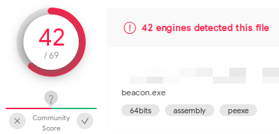

接下来就试试 Artifact Kit 进行免杀的效果，有条件的可以去官网下载支持一下正版。

当然 Github 上也有人上传了，项目地址：<https://github.com/Cliov/Arsenal>

这里使用 Artifact Kit 中的 dist-peek 方法进行测试。

来到 Cobalt Strike 下打开 `Cobalt Strike -> Script Manager`，Load 加载 `/Arsenal/artifact/dist-peek/artifact.cna` 插件，之后在 `Attacks -> Packages -> Windows Executable` 中生成木马文件。

使用 VT 检测发现仅有 8 个引擎检测到，感觉效果好像还行。

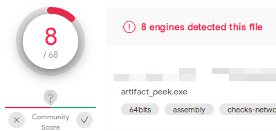

把每个杀软的病毒库升级到最新后，实测可以过腾讯电脑管家、火绒，但 360 安全卫士 、 360 杀毒不行。

> 说句题外话，至于为什么用了两款 360 的产品，主要就是为了截图好看些。

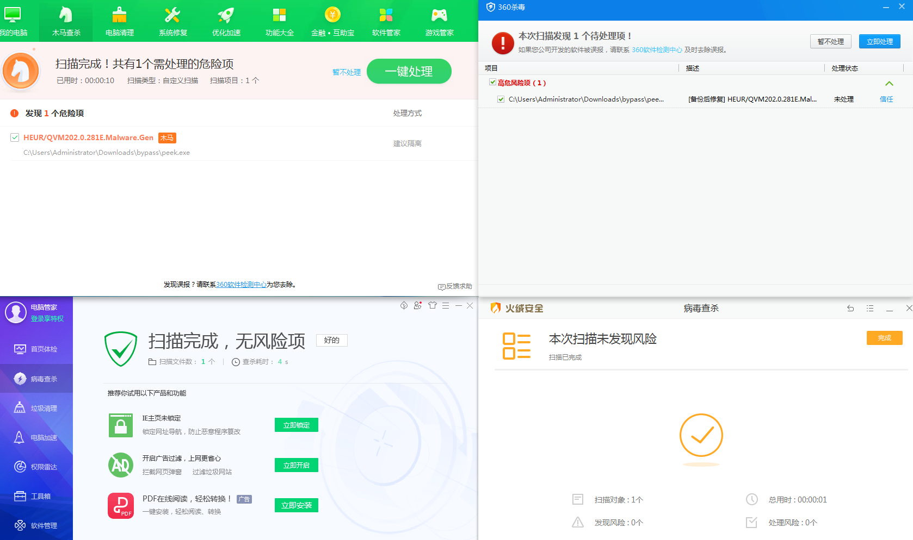

### Veil Evasion

此外，也可以使用 Veil Evasion 框架，Veil Evasion 的安装也是比较简单的，Veil-Evasion 在 Kali 2020以前是自带的，但 Kali 2020 中是需要独立安装的。在 Kali 中可以直接使用 apt-get 进行安装。

```plain
git config --global http.proxy 'socks5://127.0.0.1:1080'
git config --global https.proxy 'socks5://127.0.0.1:1080'

apt-get install veil-evasion
veil
```

其他系统可以使用 veil-evasion 项目中的介绍进行安装，项目地址：<https://github.com/Veil-Framework/Veil-Evasion>

由于 Veil Evasion 有 200 多 M ，因此建议挂上代理进行下载安装。

安装完成之后，在 Cobalt Strike 里的 `Attacks -> Packages -> Payload Generator`  中选择 Veil 输出生成一个 payload.txt 文件

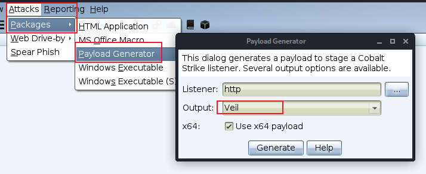

随后来到 Kali 下，输入 `veil` 启动，输入 `use Evasion` 使用 Evasion 工具，`list` 查看当前可用的 Payload

```plain
veil
use Evasion
list
```

这里使用第 17 个即 `go/shellcode_inject/virtual.py` Payload 作为示例，因为 go、c 等编译性语言语言相对于 python 等脚本语言来说免杀效果会好些。

```plain
use 17
```

之后输入 `generate`，选择第三项 `Custom shellcode string` ，粘贴刚生成的 payload.txt 文本内容，输入要生成的 exe 文件名，即可生成一个免杀木马。

```plain
generate
3
粘贴 payload.txt 内容
bypass_go	#生成文件的名称
```

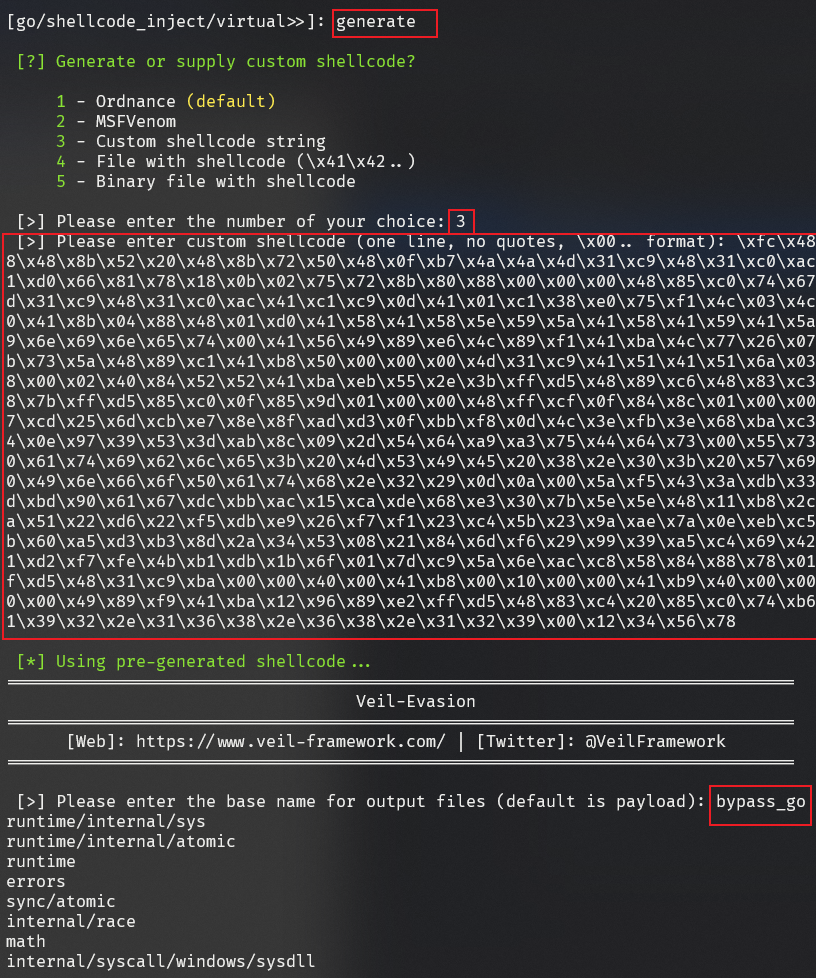

使用 virustotal 查杀了一下生成的 bypass\_go.exe，发现被 40 个引擎检测到，不得不说这效果很一般。

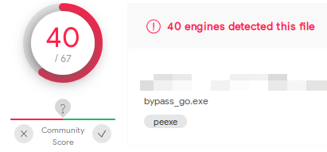

实测可以过360 安全卫士、 360 杀毒，但腾讯电脑管家、火绒不行。

> 看到 VT 的检测结果后，我还以为四款杀软都能检测到呢，没想到啊。

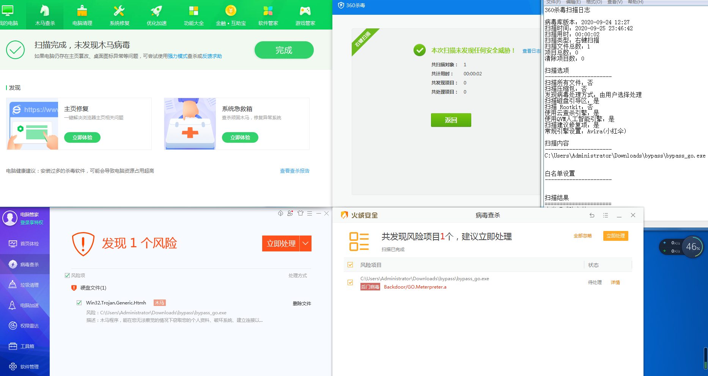

### 免杀插件

后来又在 GitHub 上发现一款免杀插件，2 个月前更新的，项目地址：<https://github.com/hack2fun/BypassAV>

使用方法可以参考项目中的介绍，目前效果感觉还是可以的，在 virustotal 上只被 10 个引擎检测到。

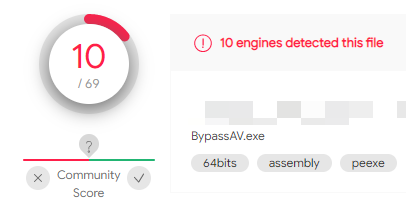

实测可以过 360 安全卫士、360 杀毒、腾讯电脑管家，但火绒不行。

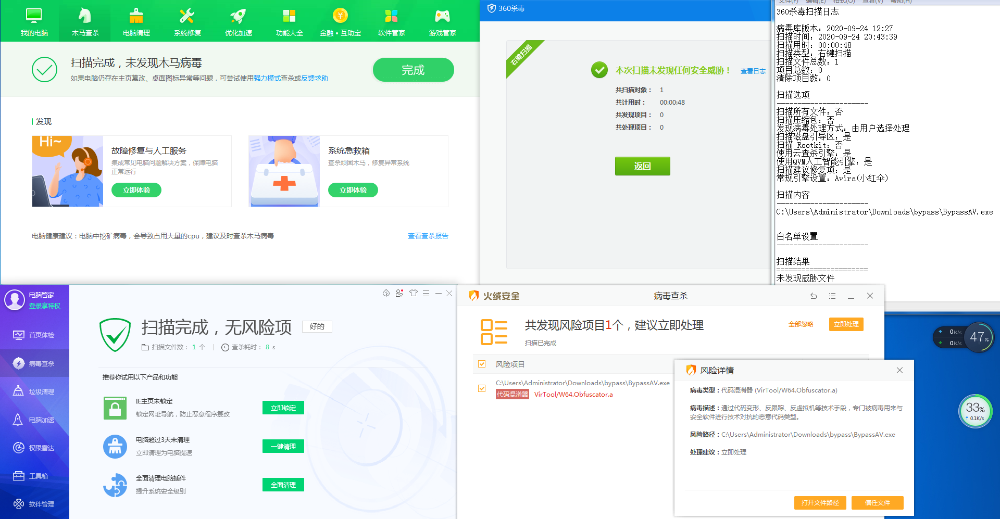

在测试完成之后，开始体会到为什么要判断目标使用了哪款杀软的目的了，就上面测试的情况来说，每一家都出现未检测到的情况。在实际的环境中，还是要根据目标的具体情况具体分析。

> Emm，浏览器首页又被 360 改成 360 导航了。
>
> 另外不得不说一句，从使用的角度来说，火绒是这里面最乖的，没有其他杀毒软件那么多花花肠子。

**补充**

进行云查杀的一些情况：

1、首先判断文件是否为正常文件

2、如果判断为可疑文件，则把文件的 hash 上传到云上

3、同时把这个文件标记为可疑文件，而不是正常文件

因此可以通过修改我们的脚本来使其跳过云查杀，就像是在白名单里的程序一样。

### Java Applet

接下来一起来看看 Cobalt Strike Java Applet 攻击，在 Cobalt Strike 的源码中内置了用于攻击 Java Applet 签名的 Applet 工具。

使用 Applet 工具的步骤如下：

1、到 `Help -> Arsenal`

2、如果需要的话就修改/混淆病毒文件

3、使用代码签名证书进行签名

4、构建

5、使用 Applet Kit 加载脚本

大概在 2014 年 7 月，开始有人在钓鱼中使用宏攻击，在几年前，这是一种效果还很不错的攻击方式。

## 3、应用白名单

站在防御者的角度，一个好的防御应该是列出只允许自己运行的应用程序白名单而不允许他人运行。对于攻击者则是使用白名单应用程序将代理放到内存中的方法来进行攻击，Java Applet 攻击就是这样做的。

一种攻击的方法是直接插入内存进行攻击。Java Applet、Office 宏、CS 下的 PowerShell 命令行都是这样做的。

一些白名单免杀的资料：

<https://twitter.com/subTee>

<https://github.com/khr0x40sh/WhiteListEvasion>

### 白名单申请

Win + R 打开运行窗口，输入 `gpedit.msc` ，来到 `用户配置 -> 管理模板 -> 系统` 处，打开 `只允许指定的 Windows 程序`

在打开的窗口中，勾选`已启用`，之后点击`显示`按钮，在其中写入白名单的程序名称后，点击两次确定之后即可。

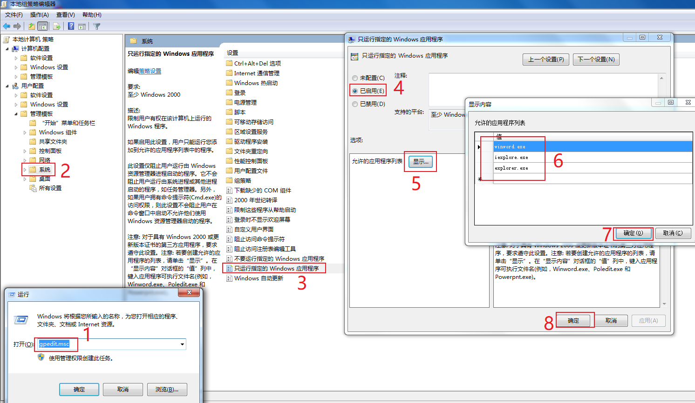

## 4、宏攻击

在 Cobalt Strike 客户端上，选择 `Packages --> MS Office Macro`，指定一个监听器，点击 `Generate`，之后根据提示的步骤生成一个 Word 文档。

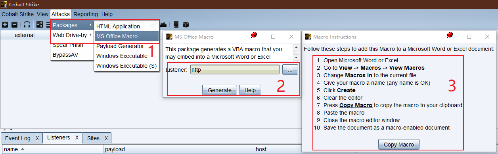

大体的步骤如下：

1、打开 Microsoft Word 或者 Excel

2、来到 `视图 --> 宏`

3、任意填写一个宏的名称

4、宏的位置选择为当前文档

5、点击创建

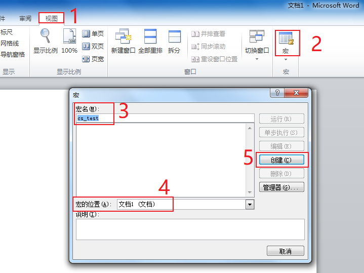

6、在打开的编辑器中，删除掉原来的内容

7、点击 Cobalt Strike 上的 `Copy Macro` 按钮

8、将刚复制 Cobalt Strike 生成的内容粘贴到打开的编辑器中

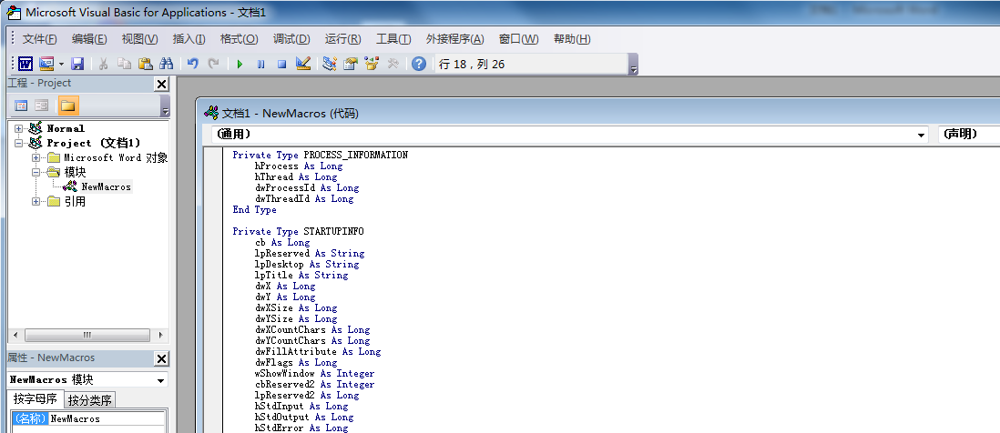

9、关闭编辑器

10、将文档保存为启用宏的文档，这里可以选择保存为 `启用宏的 Word 文档` 或者 `Word 97-2003 文档`

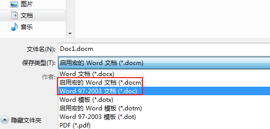

接下来使用钓鱼邮件等方式上传到靶机，当靶机运行该文档后启用宏内容即可上线。

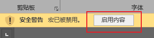

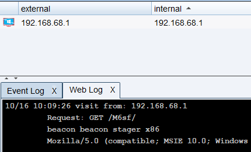

> 这里不得不吐槽一句，Microsoft Office 的东西安装是真的麻烦。

在上面 2-8 步骤创建编辑宏内容的过程，也可以打开 `开发工具 --> Visual Basic` 界面，这里推荐使用快捷键`Alt+F11`打开该界面。

之后编辑`ThisDocument` 模块，粘贴宏代码也可以达到上述 2-8 步的效果。

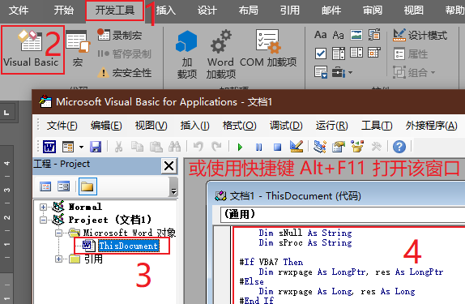
